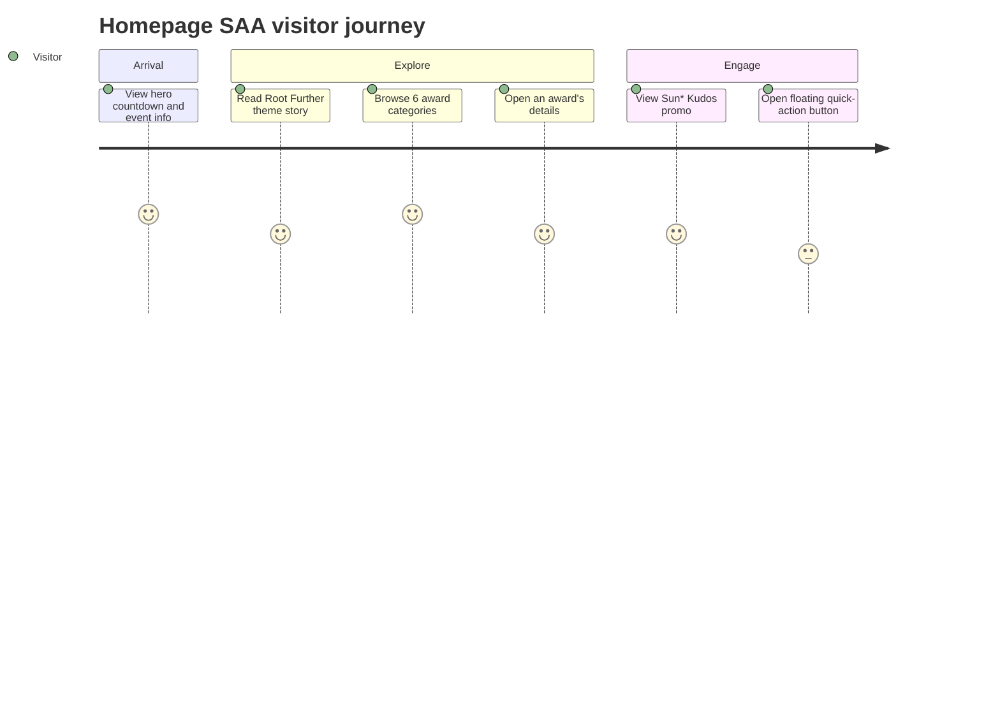

## Screen List

| Screen Name | What User Sees | What User Can Do |
|-------------|----------------|-------------------|
| Homepage SAA | Sticky header (logo, nav, language switcher), hero with "ROOT FURTHER" title, "Coming soon" label, live countdown, event datetime/venue/broadcast note, two CTA buttons; below the fold, the "Root Further" theme story, a 6-card award grid, a Sun* Kudos promo banner, a fixed floating quick-action button, and a footer | Watch the countdown update, click nav links, switch language, click either CTA button, click any award card (image/title/"Chi tiết") to view award details, click the Kudos banner's "Chi tiết", open the floating quick-action button |

## User Journey

1. The visitor arrives at Homepage SAA and immediately sees the hero countdown, event date/venue,
   and the two "ABOUT AWARDS" / "ABOUT KUDOS" call-to-action buttons.
2. The visitor scrolls down through the "Root Further" theme story, reads the pull-quote, and
   continues to the Awards section.
3. The visitor reviews the six award cards, then clicks a card (image, title, or "Chi tiết") and is
   taken to the corresponding award's details.
4. Back on Homepage SAA (or via the header/footer nav), the visitor reaches the Sun* Kudos promo
   banner and clicks "Chi tiết" to learn more about the recognition program.
5. At any point, the visitor can use the header's language switcher to toggle VN/EN, or use the
   floating quick-action button in the bottom-right corner.

