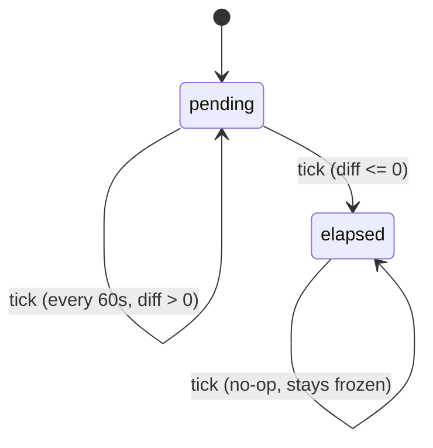

# F001_HomepageSaa

**Priority**: P1
**Type**: ui
**Generated**: 2026-07-02

## Overview

The Homepage SAA is the public, unauthenticated single-page marketing site for "Sun* Annual Awards
2025" (theme "Root Further"). It renders a sticky header, a hero/keyvisual section with a live
countdown to the event start datetime, long-form theme copy, a 6-card award category grid, a
Sun* Kudos promo banner, a floating quick-action widget button, and a footer — all sourced from a
MoMorph design (fileKey `9ypp4enmFmdK3YAFJLIu6C`, frame "Homepage SAA", node `2167:9026`). No
backend/auth exists yet in this repo; the page is static/client-rendered except for the countdown,
which is pure client-side logic driven by a configurable event-start environment variable. Anyone
visiting the site (no login required) is the primary audience; auth-gated affordances (notification
bell content, avatar/account menu, admin dashboard entry) are visual stubs only — see
`## Assumptions`.

## Polymorphic Behavior

N/A — no discriminator fields in Key Entities.

## Cross-Cutting Logic

### Requirements

| Code | Description | Endpoint/Handler | Verifiable |
|------|-------------|------------------|------------|
| FR-001 | Render sticky header with logo, nav links, language switcher, and (visual-only) notification/avatar affordances | Client component `Header` | yes |
| FR-002 | Render hero/keyvisual with title, "Coming soon" label, 3-tile countdown, event info block, and two CTA buttons | Client component `Hero` | yes |
| FR-003 | Render "Root Further" long-form static content block with pull-quote | Client component `RootFurtherContent` | yes |
| FR-004 | Render Awards section (header + 6-card responsive grid) with outbound links to Awards Information anchors | Client component `AwardsSection` | yes |
| FR-005 | Render Sun* Kudos promo banner with outbound link to Kudos detail page | Client component `KudosBanner` | yes |
| FR-006 | Render fixed floating quick-action pill button (stub menu) | Client component `FloatingWidgetButton` | yes |
| FR-007 | Render footer with logo, nav links, and copyright text | Client component `Footer` | yes |
| FR-008 | Compute and auto-refresh countdown (DAYS/HOURS/MINUTES) client-side from an ISO-8601 event-start env var, freezing at `00` per tile at/after zero, never negative | Client hook `useCountdown` | yes |
| FR-009 | Stub route `/awards-information` as a minimal placeholder page with one anchor-targetable section per award slug (so award-card links resolve, not dead) | Route `app/awards-information/page.tsx` | yes |
| FR-010 | Stub route `/sun-kudos` as a minimal placeholder page | Route `app/sun-kudos/page.tsx` | yes |

**Source:** `N/A — no source code written yet.`

### Business Rules

#### BR-001_CountdownNeverNegative
**Linked FR:** FR-008
**Source:** `N/A — not yet implemented; enforce at build time.`
**Applies to:** the 3 countdown tiles (DAYS/HOURS/MINUTES)
**Rule:** Once the current time reaches or passes the configured event-start datetime, all three
tiles MUST display `00` and MUST NOT go negative or wrap. The "Coming soon" label MUST be hidden at
that point.

**Pseudocode:**
```text
diff = eventStart - now
if diff <= 0:
  days = hours = minutes = 0
  showComingSoon = false
else:
  days = floor(diff / 1 day)
  hours = floor((diff % 1 day) / 1 hour)
  minutes = floor((diff % 1 hour) / 1 minute)
  showComingSoon = true
render zeroPad2(days), zeroPad2(hours), zeroPad2(minutes)
```

#### BR-002_CountdownZeroPadded
**Linked FR:** FR-008
**Source:** `N/A — not yet implemented; enforce at build time.`
**Applies to:** the 3 countdown tiles
**Rule:** Every numeric tile value MUST render as a 2-digit zero-padded string (e.g. `05`, not `5`),
including `00` and any value up to `99`. Values ≥100 (e.g. >99 days) MUST still render at least 2
digits without truncation (no clamp defined by design — treat as 3+ digit passthrough).

**Pseudocode:**
```text
zeroPad2(n) = n < 10 ? "0" + n : String(n)
```

#### BR-003_InvalidEventDateFallback
**Linked FR:** FR-008
**Source:** `N/A — not yet implemented; enforce at build time.`
**Applies to:** the event-start environment variable parse step
**Rule:** If the configured event-start value is missing, malformed, or fails ISO-8601 parsing, the
countdown MUST NOT crash the page render. It MUST fall back to a safe default (treat as already
elapsed — freeze all tiles at `00`, hide "Coming soon").

**Pseudocode:**
```text
try:
  eventStart = parseISO8601(env.NEXT_PUBLIC_SAA_EVENT_START)
  if not isValidDate(eventStart): raise
catch:
  eventStart = null
  # render as elapsed
  days = hours = minutes = "00"
  showComingSoon = false
```

#### BR-004_CountdownRefreshInterval
**Linked FR:** FR-008
**Source:** `N/A — not yet implemented; enforce at build time.`
**Applies to:** the countdown timer refresh loop
**Rule:** The countdown MUST recompute at least once per minute so minute-tile changes are visible
in real time without requiring a page reload.

**Pseudocode:**
```text
on mount: tick(); interval = setInterval(tick, 60_000)
on unmount: clearInterval(interval)
```

#### BR-005_AwardGridResponsiveColumns
**Linked FR:** FR-004
**Source:** `N/A — not yet implemented; enforce at build time.`
**Applies to:** the 6-card award grid layout
**Rule:** The award grid MUST render 3 columns at desktop breakpoints and 2 columns at
tablet/mobile breakpoints, per design. The smallest breakpoint MAY fall back to 1 column if content
does not fit at 2 columns (see `## Assumptions`).

**Pseudocode:**
```text
grid-cols: base=2 md=2 lg=3   # smallest breakpoint may drop to 1 (assumption)
```

#### BR-006_AwardCardOutboundAnchor
**Linked FR:** FR-004
**Source:** `N/A — not yet implemented; enforce at build time.`
**Applies to:** each of the 6 award cards (image, title, "Chi tiết" link)
**Rule:** Clicking the thumbnail image, the title, or the "Chi tiết" link on any award card MUST
navigate to the Awards Information page with a URL hash matching that award's slug (e.g.
`/awards-information#top-talent`), so the destination page can auto-scroll to that section. All
three click targets on a card navigate to the same destination.

**Pseudocode:**
```text
href = "/awards-information#" + slugify(award.name)
onClick(image | title | detailsLink) -> navigate(href)
```

#### BR-007_HeaderFooterNavScrollTop
**Linked FR:** FR-001
**Source:** `N/A — not yet implemented; enforce at build time.`
**Applies to:** header logo, footer logo, and "About SAA 2025" nav link
**Rule:** Clicking the header or footer logo, or the "About SAA 2025" nav link, navigates to the
homepage and scrolls the viewport to the top.

**Pseudocode:**
```text
onClick(logo | aboutSaaLink) -> navigate("/") ; scrollTo(0, 0)
```

### Decision Logic

N/A — no user-facing decision logic beyond DISC-### Polymorphic Behavior.

### State Machines

#### SM-001_CountdownTimerState
**kind:** ui
**Linked FR:** FR-008
**Source:** `N/A — not yet implemented; enforce at build time.`
**States:** `pending` (countdown running, "Coming soon" visible), `elapsed` (all tiles frozen at
`00`, "Coming soon" hidden)



**Transition rules:**
- `pending → pending`: guard = event-start minus now > 0; side effects = re-render 3 tiles with new values
- `pending → elapsed`: guard = event-start minus now <= 0 (or invalid/unparseable event-start, per BR-003); side effects = freeze tiles at `00`, hide "Coming soon" label

### Algorithms

None.

### External Integrations

None — this MVP has no backend or third-party API calls. Nav destinations
("Awards Information", "Sun* Kudos") are internal routes/anchors, not external integrations.

### Verification

- **SC-001** Countdown tiles show correct zero-padded DAYS/HOURS/MINUTES and update at least once per minute (covers FR-008, BR-002, BR-004)
- **SC-002** Countdown freezes at `00` and hides "Coming soon" once event-start has passed, and never shows negative values (covers BR-001)
- **SC-003** Malformed/missing event-start env var does not crash the page; renders elapsed-state fallback (covers BR-003)
- **SC-004** Each of the 6 award cards navigates to the correct Awards Information anchor from image, title, and "Chi tiết" link (covers FR-004, BR-006)
- **SC-005** Award grid renders 3 columns at desktop width and 2 columns at tablet/mobile width (covers BR-005)

---

**Client behavior:** see
[`behavior-logic.md`](../../docs/system/behavior-logic.md) (client-side patterns — debounce, optimistic UI, polling, upload, realtime),
[`permissions.md`](../../docs/system/permissions.md) (feature flags / experiments / env / locale gates),
[`architecture.md`](../../docs/system/architecture.md) (guards / deep-link state restoration / unsaved-changes protection).

## User Stories

### US001_ViewHeroAndCountdown — View hero keyvisual and event countdown (Priority: P1)

**What happens:** Any visitor lands on the homepage and sees the "ROOT FURTHER" hero title, the
"Coming soon" label (while the event is upcoming), a live 3-tile countdown (DAYS/HOURS/MINUTES),
the event info block (datetime, venue, broadcast note), and the "ABOUT AWARDS" / "ABOUT KUDOS" CTA
buttons.
**Why this priority:** The hero and countdown are the first thing every visitor sees and the core
purpose of the page (drive anticipation for the event); it must work correctly and never crash.
**Independent Test:** Load the homepage with a future event-start env var configured; observe the
countdown tiles counting down and updating each minute.

**Acceptance Scenarios:**

1. **Given** the event-start datetime is in the future, **When** the homepage loads, **Then** the
   countdown shows the correct zero-padded DAYS/HOURS/MINUTES and "Coming soon" is visible.
2. **Given** the event-start datetime has already passed, **When** the homepage loads, **Then**
   all three tiles show `00` and "Coming soon" is hidden.
3. **Given** the event-start env var is missing or malformed, **When** the homepage loads, **Then**
   the page renders without crashing and the countdown falls back to the elapsed state.

**Requirements fulfilled:**
- **FR-002** Render hero/keyvisual with title, "Coming soon" label, 3-tile countdown, event info
  block, and two CTA buttons — client component `Hero`
  **Source:** `N/A — not yet implemented.`
- **FR-008** Compute and auto-refresh countdown client-side — client hook `useCountdown`
  **Source:** `N/A — not yet implemented.`

**Rules enforced:** BR-001, BR-002, BR-003, BR-004 (see `## Cross-Cutting Logic`)

**State transitions:** SM-001 (see `## Cross-Cutting Logic`)

**Verification:**
- **SC-001**, **SC-002**, **SC-003** (see `## Cross-Cutting Logic > Verification`)

---

### US002_BrowseAwardCategories — Browse the 6 award categories and open award details (Priority: P1)

**What happens:** The visitor scrolls to the Awards section, sees the "Hệ thống giải thưởng"
header and a grid of 6 award cards (Top Talent, Top Project, Top Project Leader, Best Manager,
Signature 2025 - Creator, MVP), and clicks a card's image, title, or "Chi tiết" link to be taken to
the Awards Information page anchored at that award's section.
**Why this priority:** The award grid is the primary content/conversion path of the homepage
(driving traffic to award details) and one of the two headline CTAs in the hero.
**Independent Test:** Click "Chi tiết" on any of the 6 cards and confirm navigation to
`/awards-information#<slug>` with the matching award slug.

**Acceptance Scenarios:**

1. **Given** the homepage is loaded, **When** the visitor views the Awards section on desktop,
   **Then** the 6 cards render in a 3-column grid.
2. **Given** the homepage is loaded on tablet/mobile width, **When** the visitor views the Awards
   section, **Then** the 6 cards render in a 2-column grid.
3. **Given** a card's description text overflows its allotted lines, **When** rendered, **Then**
   the text is truncated with an ellipsis.
4. **Given** any award card, **When** the visitor clicks the image, title, or "Chi tiết" link,
   **Then** the browser navigates to the Awards Information page anchored at that award's section.

**Requirements fulfilled:**
- **FR-004** Render Awards section (header + 6-card responsive grid) with outbound links —
  client component `AwardsSection`
  **Source:** `N/A — not yet implemented.`

**Rules enforced:** BR-005, BR-006 (see `## Cross-Cutting Logic`)

**Verification:**
- **SC-004**, **SC-005** (see `## Cross-Cutting Logic > Verification`)

---

### US003_NavigateHeaderFooterAndLanguage — Navigate via header/footer and switch display language (Priority: P2)

**What happens:** The visitor uses the sticky header (or footer) to jump to "About SAA 2025",
"Awards Information", or "Sun* Kudos", and can open the language switcher to toggle between VN and
EN.
**Why this priority:** Secondary navigation convenience — important for usability but not the core
conversion path, and full i18n translation is out of scope for this MVP (see `## Assumptions`).
**Independent Test:** Click each header/footer nav link and confirm it resolves to a route/anchor
(no dead links); open the language switcher and confirm VN/EN options are shown.

**Acceptance Scenarios:**

1. **Given** the homepage is loaded, **When** the visitor clicks the header or footer logo,
   **Then** the page navigates home and scrolls to top.
2. **Given** the homepage is loaded, **When** the visitor opens the language switcher, **Then** a
   menu with VN and EN options appears.
3. **Given** the visitor selects a language option, **When** selection completes, **Then** the
   switcher reflects the selected language (full copy translation may be deferred — see
   `## Assumptions`).

**Requirements fulfilled:**
- **FR-001** Render sticky header — client component `Header`
  **Source:** `N/A — not yet implemented.`
- **FR-007** Render footer — client component `Footer`
  **Source:** `N/A — not yet implemented.`

**Rules enforced:** BR-007 (see `## Cross-Cutting Logic`)

**Verification:**
- **SC-006** All header/footer nav links and anchors resolve to a defined route or in-page anchor (no dead links); covers FR-001, FR-007, BR-007

---

### US004_ViewRootFurtherAndKudosPromo — Read the Root Further theme content and the Sun* Kudos promo (Priority: P3)

**What happens:** The visitor scrolls past the hero to read the long-form "Root Further" theme
copy (with pull-quote), then continues to the Sun* Kudos promo banner and can click "Chi tiết" to
go to the Kudos detail page.
**Why this priority:** Supporting/informational content; valuable for context but not required for
the primary countdown/awards conversion flow.
**Independent Test:** Scroll to the Root Further section and confirm the pull-quote renders in
italic; click the Kudos banner's "Chi tiết" and confirm it navigates to the Kudos detail route.

**Acceptance Scenarios:**

1. **Given** the homepage is loaded, **When** the visitor scrolls to the Root Further section,
   **Then** the theme body copy and the italic pull-quote render as static text.
2. **Given** the homepage is loaded, **When** the visitor clicks "Chi tiết" on the Sun* Kudos
   banner, **Then** the browser navigates to the Sun* Kudos detail route.

**Requirements fulfilled:**
- **FR-003** Render "Root Further" long-form static content block — client component `RootFurtherContent`
  **Source:** `N/A — not yet implemented.`
- **FR-005** Render Sun* Kudos promo banner — client component `KudosBanner`
  **Source:** `N/A — not yet implemented.`

**Rules enforced:** None beyond FR-003/FR-005 (static content).

**Verification:**
- **SC-007** Root Further pull-quote and Kudos banner CTA render and the CTA link resolves (covers FR-003, FR-005)

---

### US005_UseFloatingWidgetButton — Open the floating quick-action widget (Priority: P3)

**What happens:** The visitor sees a fixed bottom-right pill button (pencil icon / "write kudos" +
separator + SAA/Kudos logo mark) on any scroll position and can click it to open a quick-action
menu.
**Why this priority:** Low-priority engagement affordance; menu contents are an explicit stub for
this MVP (see `## Assumptions`).
**Independent Test:** Click the floating button and confirm a menu/placeholder opens without
crashing the page.

**Acceptance Scenarios:**

1. **Given** the homepage is loaded, **When** the visitor scrolls anywhere on the page, **Then**
   the floating pill button remains fixed at the bottom-right.
2. **Given** the floating button is visible, **When** the visitor clicks it, **Then** a quick-action
   menu opens (stub content acceptable for this MVP).

**Requirements fulfilled:**
- **FR-006** Render fixed floating quick-action pill button (stub menu) — client component `FloatingWidgetButton`
  **Source:** `N/A — not yet implemented.`

**Rules enforced:** None.

**Verification:**
- **SC-008** Floating button stays fixed on scroll and opens a menu (stub acceptable) on click; covers FR-006

### Edge Cases

See edge-cases.md.

## Key Entities

No persistent data model — this feature has no database and no backend. Content is intended to be
authored as static/config values rather than DB-backed entities.

| Entity | Table | Key Columns | Purpose |
|--------|-------|-------------|---------|
| EventConfig (conceptual) | N/A — env var, not a DB table | `NEXT_PUBLIC_SAA_EVENT_START` (ISO-8601 string) | Drives the countdown timer's target datetime |
| AwardCategory (conceptual) | N/A — static content array, not a DB table | `slug, title, description, imageUrl, detailsHref` | The 6 fixed award cards rendered in the Awards section |
| EventInfoContent (conceptual) | N/A — static/config content block, not a DB table | `eventDateTimeLabel, venueLabel, broadcastNoteLabel` | The hero's event info block (datetime, venue, livestream note) — see `## Assumptions` for copy discrepancy |

## Artifact References

| Artifact | File | Codes Used | Reviewed |
|----------|------|------------|----------|
| System Overview | [system-overview.md](../../docs/system/system-overview.md) | — | [ ] |
| Architecture | [architecture.md](../../docs/system/architecture.md) | — | [ ] |
| Feature List | [feature-list.md](../feature-list.md) | F001 | [ ] |
| API Map | [api-map.md](../../docs/generated/api-map.md) | TBD (draft) | [ ] |
| Entities | [entities.md](../../docs/generated/entities.md) | TBD (draft) | [ ] |
| Screens | [screens.md](screens.md) | TBD (draft) | [ ] |
| Behavior Logic | [behavior-logic.md](../../docs/system/behavior-logic.md) | TBD (draft) | [ ] |
| Permissions Matrix | [permissions-matrix.md](../../docs/generated/permissions-matrix.md) | TBD (draft) | [ ] |
| User Stories | [user-stories.md](../../docs/generated/user-stories.md) | TBD (draft) | [ ] |

## Assumptions

- No auth/backend system exists yet in this repo. Notification bell content, the account avatar
  dropdown (Profile/Sign out/Admin Dashboard), and admin-only menu items are represented as
  **static visual affordances only** for this MVP — no real auth state, no unread-badge logic, no
  role gating. Full implementation is deferred until an auth backend exists.
- **Resolved (user decision):** "Awards Information" and "Sun* Kudos" are stubbed as minimal
  placeholder pages in this same feature build (`/awards-information`, `/sun-kudos` — see FR-009,
  FR-010), not left as `#`/anchor-only links.
- **Resolved (user decision):** The hero event info block ships with the MoMorph mock's visible
  rendered copy as the literal placeholder content: datetime "26/12/2025", venue "Âu Cơ Art
  Center", broadcast note "Tường thuật trực tiếp qua sóng Livestream". The alternate
  description-field copy ("18h30" / "Nhà hát nghệ thuật quân đội" / Group Facebook note) is not
  used, but the 3 fields remain content-config values (not hardcoded strings) so they can be
  changed later without a code change.
- **Resolved (user decision):** The "Best Manager", "Signature 2025 - Creator", and "MVP" award
  cards ship with the identical description string exactly as it appears in the source design
  ("Vinh danh người quản lý có năng lực quản lý tốt, dẫn dắt đội nhóm") — faithfully reproduced,
  not corrected with invented distinct copy.
- Award grid smallest breakpoint (narrow mobile) is assumed to safely fall back to 1 column if 2
  columns is too cramped; the design/test cases only explicitly specify desktop=3-col and
  tablet/mobile=2-col.
- **Resolved (user decision):** The VN/EN language switcher ships as a **non-functional UI
  affordance** for this MVP — the menu opens and shows VN/EN options, but selecting a language
  does not change rendered copy (no i18n infrastructure exists yet in this greenfield repo).
- The floating widget button's quick-action menu contents (beyond the pencil/"write kudos" icon and
  separator + logo mark) are out of scope; only the button and menu-open affordance are built.
- Event-start datetime is assumed to be sourced from a public (`NEXT_PUBLIC_`-prefixed) environment
  variable since the countdown must compute client-side; no build/deploy pipeline decision is
  implied beyond that naming convention.

## Source Code References

No source code written yet — see `## User Stories` for planned components (`Header`, `Hero`,
`RootFurtherContent`, `AwardsSection`, `KudosBanner`, `FloatingWidgetButton`, `Footer`), the
`useCountdown` client hook, and the `/awards-information` + `/sun-kudos` stub routes.

## Unresolved Questions

None — all 4 gaps raised during spec authoring were resolved by the user at Rest Point 1.5
(destination routes, i18n scope, award-card copy duplication, event info literal copy); see the
`**Resolved (user decision)**` entries under `## Assumptions` above.
