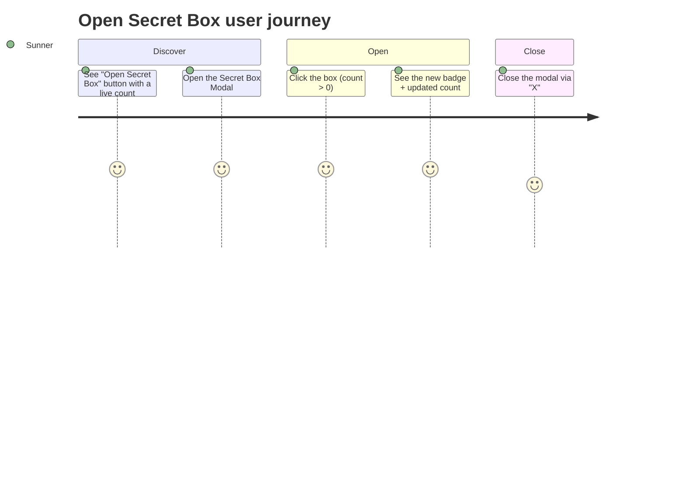

## Screen List

| Screen Name | SCR### | What User Sees | What User Can Do |
|-------------|--------|-----------------|-------------------|
| Secret Box Modal | TBD (draft) | Title "KHÁM PHÁ SECRET BOX CỦA BẠN", close "X" (top-right), a divider, an instruction line (hidden once the count is 0), a centered box illustration, and a bottom counter (white label "Secretbox chưa mở" + large yellow number) | Close the modal via "X"; click the box to open one Secret Box when the count is above 0; see the newly revealed badge inside the box frame after opening |

## User Journey

1. User arrives at the Kudos sidebar or the Profile page and sees the "Open Secret Box" button.
2. User clicks the button and the Secret Box Modal opens, showing the title, the instruction line
   (only when they have at least one unopened box), the box illustration, and their current
   unopened count.
3. If the user has zero unopened boxes, the instruction line is hidden and clicking the box does
   nothing.
4. If the user has at least one unopened box, clicking the box reveals a random badge inside the
   box frame and the counter decreases by one.
5. User closes the Secret Box Modal via the "X" button and returns to whichever page they opened it
   from.

