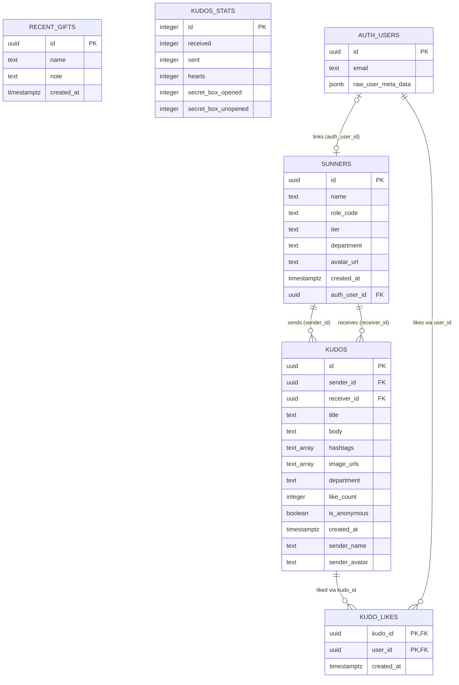

<!-- layout-exempt: rebuild-spec owns all docs/system|features|generated|flows paths -->
<!-- Output path: docs/generated/entities.md -->

# Entities

**Project**: aidd-ssa-2026 (Sun* Kudos)
**Generated**: 2026-07-17

## Entity Relationship Diagram

## Entities

### MODEL001_Sunner

**Description**: A person who can send or receive Kudos; also backs the recipient autocomplete and the composer directory. Comment on definition: "People who send/receive Kudos (also backs the recipient autocomplete)." Source: `supabase/migrations/0001_kudos_schema.sql:9-18`. Linked to Supabase Auth in `0005_sunners_auth_link.sql` so members who log in via Google (F005) become Kudo recipients (`supabase/migrations/0005_sunners_auth_link.sql:1-2,11-12`). Mirrored in TS as `SunnerRow` (`app/_lib/kudos/types.ts:8-15`) and the embedded join subset `KudoPersonRow` (`app/_lib/kudos/types.ts:18-23`).

| Attribute | Type | Constraints | Description |
|-----------|------|-------------|-------------|
| id | uuid | PK, NOT NULL, default `gen_random_uuid()` | Row identity. `supabase/migrations/0001_kudos_schema.sql:11` |
| name | text | NOT NULL | Display name. `0001_kudos_schema.sql:12` |
| role_code | text | NOT NULL | Free-form role/employee code (e.g. `CEVC10`), not an enum — values generated per-row in `supabase/seed.sql:38`. `0001_kudos_schema.sql:13` |
| tier | text | NOT NULL, default `'New Hero'` | Hero-tier label; a fixed 3-value set at seed time (`'New Hero'`, `'Rising Hero'`, `'Legend Hero'` — `supabase/seed.sql:39`) but rendered as plain text with no per-value styling/behavior (`app/_components/sun-kudos/tier-badge.tsx:6-13`) — display label only, not a discriminator. `0001_kudos_schema.sql:14` |
| department | text | NOT NULL, default `'CEVC'` | Denormalized department; bounded to `DEPARTMENT_FILTERS` at the app layer (`app/_lib/sun-kudos-content.ts:56-62`) but used only as an equality filter value with no per-value behavior branch. `0001_kudos_schema.sql:15` |
| avatar_url | text | nullable | Profile picture URL. `0001_kudos_schema.sql:16` |
| created_at | timestamptz | NOT NULL, default `now()` | Row creation timestamp. `0001_kudos_schema.sql:17` |
| auth_user_id | uuid | FK → `auth.users(id)` ON DELETE SET NULL, UNIQUE, nullable | Links a sunner to the Supabase Auth account that owns it; NULL for seeded/legacy rows. Auto-populated on first login and backfilled for prior logins. `supabase/migrations/0005_sunners_auth_link.sql:11-12,49-59` |

**Relationships**:
- One-to-Many with MODEL002_Kudo via `kudos.sender_id` (`0001_kudos_schema.sql:24`)
- One-to-Many with MODEL002_Kudo via `kudos.receiver_id` (`0001_kudos_schema.sql:25`)
- One-to-Zero-or-One with MODEL003_AuthUser via `sunners.auth_user_id` (`0005_sunners_auth_link.sql:12`)

**Discriminator Fields**: None. `tier` and `department` are bounded value sets but drive no distinct behavioral outcome (see column notes above) — not DISC per scope rule.

---

### MODEL002_Kudo

**Description**: A recognition/thanks message from one sunner to another. Comment on definition: "A recognition/thanks message. hashtags/image_urls kept as arrays (KISS — no join tables at this scope). department is denormalized for cheap filtering." Source: `supabase/migrations/0001_kudos_schema.sql:20-34`. Extended in `0002_kudos_sender_identity.sql` to carry a denormalized sender identity for user-created Kudos so a Kudo can be attributed to the logged-in author without a `sunners` row (`supabase/migrations/0002_kudos_sender_identity.sql:1,5-8`). Realtime-enabled for the live board (`0003_kudos_realtime.sql:1,15-18`). Mirrored in TS as `KudoRow` (`app/_lib/kudos/types.ts:26-41`) and mapped to the view shape `KudoCard` (`app/_lib/kudos-shared.ts:7-31`, mapper `app/_lib/kudos/map.ts:39-68`).

| Attribute | Type | Constraints | Description |
|-----------|------|-------------|-------------|
| id | uuid | PK, NOT NULL, default `gen_random_uuid()` | Row identity. `0001_kudos_schema.sql:23` |
| sender_id | uuid | FK → `sunners(id)` ON DELETE SET NULL, nullable | Seeded/directory sender; NULL for anonymous or when the FK'd sunner is deleted. `0001_kudos_schema.sql:24` |
| receiver_id | uuid | FK → `sunners(id)` ON DELETE SET NULL, nullable | Recipient; drives Spotlight nodes (`app/_lib/kudos/queries.ts:111-122`). `0001_kudos_schema.sql:25` |
| title | text | NOT NULL | Kudo headline. `0001_kudos_schema.sql:26` |
| body | text | NOT NULL | Kudo message body. `0001_kudos_schema.sql:27` |
| hashtags | text[] | NOT NULL, default `'{}'` | Tags from a fixed composer catalog `HASHTAG_OPTIONS` (`app/_lib/write-kudo-content.ts:30-39`); multi-valued, no per-tag behavior. `0001_kudos_schema.sql:28` |
| image_urls | text[] | NOT NULL, default `'{}'` | Optional attached photo captions/placeholders. `0001_kudos_schema.sql:29` |
| department | text | NOT NULL, default `'CEVC'` | Denormalized from receiver for cheap filtering (`.eq("department", ...)`, `app/_lib/kudos/queries.ts:52,71`). `0001_kudos_schema.sql:30` |
| like_count | integer | NOT NULL, default 0 | Denormalized counter; the ONLY writer is the `kudo_likes` insert/delete trigger, never client-set. `0001_kudos_schema.sql:31`; trigger at `supabase/migrations/0004_kudos_likes.sql:29-45` |
| is_anonymous | boolean | NOT NULL, default `false` | Hides sender identity in the view mapping (`senderName`/`senderRole`/`senderAvatar` all suppressed when true, `app/_lib/kudos/map.ts:44-54`). Boolean flag — behavioral impact belongs in feature-spec Business Rules, not a DISC here. `0001_kudos_schema.sql:32` |
| created_at | timestamptz | NOT NULL, default `now()` | Row creation timestamp; primary/secondary sort key across feeds. `0001_kudos_schema.sql:33` |
| sender_name | text | nullable | Denormalized display name of the authenticated author (user-created Kudos); NULL for seeded rows. `0002_kudos_sender_identity.sql:7` |
| sender_avatar | text | nullable | Denormalized avatar of the authenticated author. `0002_kudos_sender_identity.sql:8` |

**Relationships**:
- Many-to-One with MODEL001_Sunner via `sender_id` (`0001_kudos_schema.sql:24`)
- Many-to-One with MODEL001_Sunner via `receiver_id` (`0001_kudos_schema.sql:25`)
- One-to-Many with MODEL004_KudoLike via `kudo_likes.kudo_id` (`0004_kudos_likes.sql:5-9`)

**Discriminator Fields**: None. `is_anonymous` is a boolean single-field conditional (see Description) — documented as a behavioral flag, not a DISC per this task's scope rule.

---

### MODEL004_KudoLike

**Description**: Per-user like/heart toggle on a Kudo, with `kudos.like_count` kept in sync by DB triggers. Comment on definition: "per-user like toggle (kudo_likes) + count-sync triggers." Source: `supabase/migrations/0004_kudos_likes.sql:1,5-10`. No corresponding TS row type is exported — read inline as `{ kudo_id: string }` in `app/_lib/kudos/queries.ts:25-41`.

| Attribute | Type | Constraints | Description |
|-----------|------|-------------|-------------|
| kudo_id | uuid | PK (composite), FK → `kudos(id)` ON DELETE CASCADE, NOT NULL | The liked Kudo. `0004_kudos_likes.sql:6,9` |
| user_id | uuid | PK (composite), FK → `auth.users(id)` ON DELETE CASCADE, NOT NULL | The liking Supabase Auth user (a like requires a real, authenticated actor — no anon likes; RLS `own insert kudo_likes` requires `auth.uid() = user_id`, `0004_kudos_likes.sql:19-21`). `0004_kudos_likes.sql:7,9` |
| created_at | timestamptz | NOT NULL, default `now()` | When the like was created. `0004_kudos_likes.sql:8` |

**Relationships**:
- Many-to-One with MODEL002_Kudo via `kudo_id` (`0004_kudos_likes.sql:6`)
- Many-to-One with MODEL003_AuthUser via `user_id` (`0004_kudos_likes.sql:7`)

**Discriminator Fields**: None.

---

### MODEL005_RecentGift

**Description**: The "10 Sunner nhận quà mới nhất" sidebar list. Comment on definition: `supabase/migrations/0001_kudos_schema.sql:40`. Standalone — `name`/`note` are plain denormalized text, no FK to `sunners`. Mirrored in TS as `RecentGiftRow` (`app/_lib/kudos/types.ts:44-47`), mapped 1:1 to `RecentGiftSunner` (`app/_lib/kudos/map.ts:88-90`).

| Attribute | Type | Constraints | Description |
|-----------|------|-------------|-------------|
| id | uuid | PK, NOT NULL, default `gen_random_uuid()` | Row identity. `0001_kudos_schema.sql:42` |
| name | text | NOT NULL | Recipient display name (free text, not FK'd). `0001_kudos_schema.sql:43` |
| note | text | NOT NULL | Gift description (e.g. "Nhận được 1 áo phông SAA"). `0001_kudos_schema.sql:44` |
| created_at | timestamptz | NOT NULL, default `now()` | Sort key for the top-10 feed (`app/_lib/kudos/queries.ts:145-157`). `0001_kudos_schema.sql:45` |

**Relationships**: None — standalone table, no FKs in either direction.

**Discriminator Fields**: None.

---

### MODEL006_KudosStat

**Description**: Single-row sidebar counters not derivable from `kudos` (Secret Box, personal totals). Comment on definition: "Sidebar counters that are not derivable from kudos ... Single-row table (id = 1) seeded with demo values." Source: `supabase/migrations/0001_kudos_schema.sql:49-59`. Mirrored in TS as `KudosStatsRow` (`app/_lib/kudos/types.ts:50-56`), mapped to 5 display rows in `app/_lib/kudos/map.ts:71-86`.

| Attribute | Type | Constraints | Description |
|-----------|------|-------------|-------------|
| id | integer | PK, default 1, CHECK `id = 1` | Singleton guard — exactly one row can ever exist. `0001_kudos_schema.sql:52,58` |
| received | integer | NOT NULL, default 0 | Personal "received" counter (demo value 25, `supabase/seed.sql:133`). `0001_kudos_schema.sql:53` |
| sent | integer | NOT NULL, default 0 | Personal "sent" counter. `0001_kudos_schema.sql:54` |
| hearts | integer | NOT NULL, default 0 | Personal "hearts" counter. `0001_kudos_schema.sql:55` |
| secret_box_opened | integer | NOT NULL, default 0 | Opened Secret Box count. `0001_kudos_schema.sql:56` |
| secret_box_unopened | integer | NOT NULL, default 0 | Unopened Secret Box count. `0001_kudos_schema.sql:57` |

**Relationships**: None — standalone singleton, no FKs.

**Discriminator Fields**: None.

---

### MODEL003_AuthUser

**Description**: `auth.users` — Supabase-managed authentication table (schema `auth`, not created by this project's migrations). Included because two app tables hold FKs into it: `sunners.auth_user_id` (`0005_sunners_auth_link.sql:12`) and `kudo_likes.user_id` (`0004_kudos_likes.sql:7`). A trigger on this table (`on_auth_user_created`) auto-creates a `sunners` row on first login (`0005_sunners_auth_link.sql:19-46`). Only `id`, `email`, and `raw_user_meta_data` are read by app code (`0005_sunners_auth_link.sql:28,32,51,55`); no app-owned columns exist on this table.

| Attribute | Type | Constraints | Description |
|-----------|------|-------------|-------------|
| id | uuid | PK, NOT NULL (Supabase-managed) | Auth user identity; target of `sunners.auth_user_id` and `kudo_likes.user_id`. `0005_sunners_auth_link.sql:12,33` |
| email | text | Supabase-managed | Used only as a last-resort display-name fallback when `raw_user_meta_data` has neither `full_name` nor `name`; never stored as a column on `sunners`. `0005_sunners_auth_link.sql:28,32,51,55` |
| raw_user_meta_data | jsonb | Supabase-managed | OAuth profile payload; `full_name`/`name`/`avatar_url`/`picture` keys read to seed the new `sunners` row. `0005_sunners_auth_link.sql:28,32,51,55` |

**Relationships**:
- One-to-Zero-or-One with MODEL001_Sunner via `sunners.auth_user_id` (`0005_sunners_auth_link.sql:12`)
- One-to-Many with MODEL004_KudoLike via `kudo_likes.user_id` (`0004_kudos_likes.sql:7`)

**Discriminator Fields**: None.

---

## Validation Rules

### MODEL001_Sunner

| Rule | Field | Constraint | Error Message |
|------|-------|------------|---------------|
| SunnerNameRequired | name | NOT NULL | Postgres `null value in column "name" violates not-null constraint` (`0001_kudos_schema.sql:12`) |
| SunnerAuthLinkUnique | auth_user_id | UNIQUE (nullable) | Postgres unique-violation on duplicate `auth_user_id` — backfill/insert paths use `ON CONFLICT (auth_user_id) DO NOTHING` to no-op instead (`0005_sunners_auth_link.sql:12,35,59`) |

### MODEL002_Kudo

| Rule | Field | Constraint | Error Message |
|------|-------|------------|---------------|
| KudoTitleRequired | title | NOT NULL | Postgres not-null violation (`0001_kudos_schema.sql:26`) |
| KudoBodyRequired | body | NOT NULL | Postgres not-null violation (`0001_kudos_schema.sql:27`) |
| KudoInsertAuthenticatedOnly | (row-level, RLS) | INSERT restricted `to authenticated` | Supabase RLS denial — anon insert blocked since `0002_kudos_sender_identity.sql:13-16` (supersedes the earlier demo-permissive policy) |

### MODEL004_KudoLike

| Rule | Field | Constraint | Error Message |
|------|-------|------------|---------------|
| KudoLikeUniquePerUser | (kudo_id, user_id) | Composite PK | Postgres duplicate-key violation on re-liking the same kudo (`0004_kudos_likes.sql:9`) |
| KudoLikeOwnerOnly | user_id | RLS: `auth.uid() = user_id` on INSERT/DELETE | Supabase RLS denial when acting on another user's like (`0004_kudos_likes.sql:19-24`) |

### MODEL006_KudosStat

| Rule | Field | Constraint | Error Message |
|------|-------|------------|---------------|
| KudosStatsSingleton | id | CHECK `id = 1` | Postgres check-constraint violation `kudos_stats_singleton` on any row with `id != 1` (`0001_kudos_schema.sql:58`) |

---

## Summary

- **Total Entities**: 6 (5 app-owned: Sunner, Kudo, KudoLike, RecentGift, KudosStat; 1 external/Supabase-managed: AuthUser)
- **Total Relationships**: 5 (Sunner→Kudo×2 [sender/receiver], AuthUser→Sunner, Kudo→KudoLike, AuthUser→KudoLike)
- **Total Discriminators**: 0 — no enum/fixed-value field in this schema drives distinct behavioral outcomes; `tier` and `department` are bounded display/filter values with no per-value branching, and `is_anonymous` is a boolean documented as a Business Rule concern (feature spec), not a DISC.
