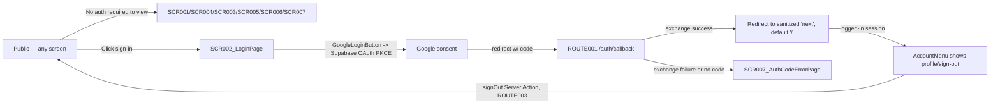

# Screen Flow

**Project**: aidd-ssa-2026 (Sun* Annual Awards 2025)
**Generated**: 2026-07-17
**Analysis Scope**: `app/` — Next.js 16 App Router frontend pages (7), cross-referenced against `screen-list.md` (this session)

**Code Format**: All SCR codes follow `SCR###_NameSlug` | `SCR###/REG###` for region-scoped transitions.

## Navigation Map

```mermaid
graph TD
    Entry[Direct URL / bookmark] -->|GET| Home[SCR001_HomePage]
    Home -->|Header nav link| Kudos[SCR004_SunKudosPage]
    Home -->|Award card deep link #slug| Awards[SCR006_AwardsInformationPage]
    Home -->|KudosBanner CTA| Kudos
    Home -->|AccountMenu sign-in link, logged out| Login[SCR002_LoginPage]
    Home -->|AccountMenu profile link, logged in| Profile[SCR003_ProfilePage]
    Login -->|GoogleLoginButton click, OAuth redirect| GoogleOAuth[External: Google consent]
    GoogleOAuth -->|redirect with code| Callback[ROUTE001 GET /auth/callback]
    Callback -->|code exchange success| Home
    Callback -->|code exchange failure| AuthErr[SCR007_AuthCodeErrorPage]
    AuthErr -->|back-to-login link| Login
    Kudos -->|AccountMenu profile link| Profile
    Kudos -->|KudosBanner not present; navigates via Header/AccountMenu only| Kudos
    Awards -->|KudosBanner CTA| Kudos
    Awards -->|Header logo| Home
    Profile -->|Header logo| Home
    Entry -->|GET /prelaunch, standalone route, no chrome, no observed inbound link| Prelaunch[SCR005_PrelaunchPage]
```

## Feature Entry Points

<!-- Populated by FS.1 researchers (feature-specs pass) after feature-list.md exists. -->

<!-- Feature Entry Points: run /tkm:rebuild-spec --feature-specs to populate -->

---

## Screen Access Paths

| From Screen | To Screen | Action/Trigger | Conditions | Region |
|-------------|-----------|----------------|------------|--------|
| Entry | SCR001_HomePage | Direct URL `/` | None | |
| Entry | SCR005_PrelaunchPage | Direct URL `/prelaunch` | None (no observed link into this route from any other screen — standalone) | |
| SCR001_HomePage | SCR004_SunKudosPage | Header nav link "Kudos" (`header.tsx:19`) | None | |
| SCR001_HomePage | SCR004_SunKudosPage | KudosBanner CTA click (`kudos-banner.tsx`) | None | |
| SCR001_HomePage | SCR006_AwardsInformationPage | AwardsSection card click → `#<slug>` deep link (`awards-section.tsx` → `award-card.tsx`) | None | |
| SCR001_HomePage | SCR002_LoginPage | AccountMenu "sign in" link (`account-menu.tsx:97-103`) | User has no active Supabase session | |
| SCR001_HomePage | SCR003_ProfilePage | AccountMenu "profile" link (`account-menu.tsx:75-81`) | User has an active Supabase session | |
| SCR001_HomePage | (overlay) WriteKudoModal / RulesModal | FAB toggle → pill click (`floating-widget-button.tsx:54-62`) | None | SCR001_HomePage/REG001 |
| SCR002_LoginPage | External (Google OAuth consent) | GoogleLoginButton click → `supabase.auth.signInWithOAuth` (`google-login-button.tsx:14-23`) | None | |
| External (Google) | ROUTE001 `/auth/callback` | OAuth provider redirect with `?code=` | Google consent granted | |
| ROUTE001 `/auth/callback` | SCR001_HomePage (or sanitized `next`) | `exchangeCodeForSession` success (`app/auth/callback/route.ts:14-16`) | `code` param present and valid | |
| ROUTE001 `/auth/callback` | SCR007_AuthCodeErrorPage | `exchangeCodeForSession` failure or missing `code` (`route.ts:18-19`) | Code exchange error | |
| SCR007_AuthCodeErrorPage | SCR002_LoginPage | "Back to login" link (`auth-error-content.tsx`) | None | |
| SCR004_SunKudosPage | (overlay) WriteKudoModal | Search-bar prompt pill click (`kudos-search-bar.tsx:47`) | None | SCR004_SunKudosPage/REG002 |
| SCR004_SunKudosPage | SCR003_ProfilePage | AccountMenu "profile" link (shared Header) | Active session | |
| SCR006_AwardsInformationPage | SCR004_SunKudosPage | KudosBanner CTA click | None | |
| SCR003_ProfilePage | SCR001_HomePage | Header logo click | None | |
| Any screen | Same screen, scrolled to top | Header logo click while already on `/` (`header.tsx:22-28`, `handleLogoClick`) | `window.location.pathname === "/"` | |

> Region column: `SCR###/REG###` used only for transitions originating from a documented region (composer/spotlight entry points); left blank for whole-screen or shared-chrome transitions.

## Screen Transitions

### SCR001_HomePage (HomePage)

**Entry Points**:
- Direct URL access (`/`)
- Header logo click from any other screen
- Post-login redirect (default `next` on successful OAuth callback)

**Exit Points**:
- To SCR004_SunKudosPage: Header nav or KudosBanner CTA
- To SCR006_AwardsInformationPage: award-card `#slug` deep link
- To SCR002_LoginPage: AccountMenu sign-in (logged out)
- To SCR003_ProfilePage: AccountMenu profile (logged in)
- To overlay (WriteKudoModal / RulesModal): FAB (REG001)

**Decision Points**:
- Session state (AccountMenu, `account-menu.tsx:20-33`): if Supabase session present → show profile/sign-out menu, else → show sign-in link. Resolved client-side via `getUser()` + `onAuthStateChange` subscription, not a route guard.

---

### SCR002_LoginPage (LoginPage)

**Entry Points**:
- From SCR001_HomePage / SCR004_SunKudosPage: AccountMenu sign-in link
- From SCR007_AuthCodeErrorPage: back-to-login link
- Direct URL access (`/login`)

**Exit Points**:
- To external Google OAuth consent screen: GoogleLoginButton click
- To SCR001_HomePage: Header logo click

**Decision Points**:
- None (no client-side redirect-if-already-authenticated guard observed on this page — `login/page.tsx` renders unconditionally regardless of session state)

---

### SCR003_ProfilePage (ProfilePage)

**Entry Points**:
- From Header AccountMenu "profile" link (any screen)
- Direct URL access (`/profile`) — **not gated**: `getCurrentUserIdentity()` fails safe to an empty identity when logged out (`profile/page.tsx:32-47`), page still renders

**Exit Points**:
- To SCR001_HomePage: Header logo click

**Decision Points**:
- None (no auth redirect; renders with empty identity if logged out — this is a documented fail-safe design choice, not a bug)

---

### SCR004_SunKudosPage (SunKudosPage)

**Entry Points**:
- From SCR001_HomePage / SCR006_AwardsInformationPage: KudosBanner CTA
- From Header nav link (any screen)
- Direct URL access (`/sun-kudos`)

**Exit Points**:
- To SCR003_ProfilePage: AccountMenu profile link
- To overlay (WriteKudoModal): search-bar prompt pill (REG002)

**Decision Points**:
- `createKudo` mutation (REG002) and `toggleHeart` mutation (REG005) both branch on server-side session state (`supabase.auth.getUser()` in `app/sun-kudos/actions.ts`) — return `{ ok: false, error: "auth_required" }` rather than redirecting; the composer surfaces the error inline (`write-kudo-modal.tsx:81`) instead of navigating away.

---

### SCR005_PrelaunchPage (PrelaunchPage)

**Entry Points**:
- Direct URL access (`/prelaunch`) only — no inbound link found anywhere in `app/` source

**Exit Points**:
- None observed (no navigation elements in `prelaunch/page.tsx`)

**Decision Points**:
- None

---

### SCR006_AwardsInformationPage (AwardsInformationPage)

**Entry Points**:
- From SCR001_HomePage: award-card `#slug` deep link
- Header nav link "Awards" (any screen)
- Direct URL access (`/awards-information`)

**Exit Points**:
- To SCR004_SunKudosPage: KudosBanner CTA
- To SCR001_HomePage: Header logo click

**Decision Points**:
- None (anchor-nav scroll-spy in `AwardSidebarNav` is in-page scroll tracking, not a screen transition)

---

### SCR007_AuthCodeErrorPage (AuthCodeErrorPage)

**Entry Points**:
- From ROUTE001 `/auth/callback` on code-exchange failure or missing `code`

**Exit Points**:
- To SCR002_LoginPage: "back to login" link

**Decision Points**:
- None

---

## Region Transitions

> Region transitions are client-state (no URL change); documented for the two composite screens' regions.

| From Region | To Target | Action/Trigger | Client-State Only |
|-------------|-----------|----------------|-------------------|
| SCR001_HomePage/REG001 (FloatingWidgetButton) | MOD001 WriteKudoModal (overlay) | Click "Viết KUDOS" pill (`floating-widget-button.tsx:77`) | Yes |
| SCR001_HomePage/REG001 (FloatingWidgetButton) | MOD002 RulesModal (overlay) | Click "Thể lệ" pill (`floating-widget-button.tsx:72`) | Yes |
| SCR001_HomePage: MOD002 RulesModal | MOD001 WriteKudoModal (overlay) | "Viết Kudo" button inside Rules drawer (`rules-modal.tsx:95-102` → `onWriteKudos`) | Yes |
| SCR004_SunKudosPage/REG002 (Search bar) | MOD001 WriteKudoModal (overlay) | Click prompt pill (`kudos-search-bar.tsx:47`) | Yes |
| SCR004_SunKudosPage/REG004 (Spotlight live) | (self, in-place patch) | Supabase Realtime INSERT event on `public.kudos` (`use-kudos-realtime.ts:36-41`) | Yes — no navigation, live count/ticker/canvas patch |
| SCR004_SunKudosPage/REG003 (Highlight) | (self, in-place filter) | Hashtag/Department dropdown change (`highlight-kudos-section.tsx:38-46`) | Yes |
| SCR004_SunKudosPage/REG005 (All Kudos feed) | (self, in-place toggle) | `HeartButton` click → optimistic `toggleHeart` (`heart-button.tsx:49-73`) | Yes |
| SCR003_ProfilePage (ProfileKudosSection) | (self, in-place toggle) | Sent/Received `FilterDropdown` selection (`profile-kudos-section.tsx:45-49`) — see `screen-list.md § SCR003` H4 judgment-call note | Yes |

---

## Authentication Flow

| Screen | Authentication Required | Authorization Level |
|--------|------------------------|-------------------|
| SCR001_HomePage | No | Public |
| SCR002_LoginPage | No | Public |
| SCR003_ProfilePage | No — **not gated** (`route-list.md` FR-001 fail-safe); renders empty identity for logged-out visitors | Public (personalizes if session present) |
| SCR004_SunKudosPage | No to view; **Yes** for `createKudo`/`toggleHeart` mutations (server-side `getUser()` guard in `app/sun-kudos/actions.ts`, returns `auth_required` inline, no redirect) | Public read / User write |
| SCR005_PrelaunchPage | No | Public |
| SCR006_AwardsInformationPage | No | Public |
| SCR007_AuthCodeErrorPage | No (reachable regardless of session state) | Public |

**Note:** `proxy.ts` (Next 16's `middleware.ts` equivalent, ROUTE002) is **refresh-only** — it keeps the Supabase auth cookie current via `updateSession()` on every matched request but does not gate or redirect any route (confirmed in `route-list.md`). There is no server-side route guard anywhere in this app; every auth check is either (a) a server component reading `getUser()` and failing safe to an empty/public view (SCR003), or (b) a Server Action's inline `auth_required` error return (ROUTE004/ROUTE005), never a redirect.

---

## Error Handling Flows

| Screen | Error | Handling | Scope |
|--------|-------|----------|-------|
| SCR002_LoginPage | OAuth code exchange failure | Redirect to SCR007_AuthCodeErrorPage (`route.ts:18`) | screen |
| SCR003_ProfilePage | Supabase `getUser()`/network error | Caught, falls back to empty identity (`profile/page.tsx:44-46`); page renders normally | screen |
| SCR004_SunKudosPage | Any of the 5 parallel data-fetch queries (`getAllKudos`, `getSpotlight`, `getSidebarStats`, `getRecentGifts`, `getSunnerOptions`) fails | Each query documented as fail-safe (empty view shape); section renders its own empty state (`page.tsx:24-29` docstring) | region (per-section, not screen-wide) |
| SCR004_SunKudosPage/REG004 | Supabase Realtime `CHANNEL_ERROR`/`TIMED_OUT` | Logged to console only; UI silently keeps the last-known server snapshot, no user-facing error (`use-kudos-realtime.ts:43-46`) | region:REG003 |
| SCR004_SunKudosPage/REG002 | `createKudo` returns `{ ok: false }` (e.g. not logged in) | Modal stays open, inline translated error shown (`write-kudo-modal.tsx:81`, `resolveComposerError`) | region:REG001 |
| SCR004_SunKudosPage/REG005 | `toggleHeart` returns `{ ok: false }` | Optimistic like/unlike rolled back to pre-click state, inline error shown (`heart-button.tsx:62-66`) | region:REG004 |

> Scope values: `screen` (affects entire screen) | `region:REG###` (error contained within the named region).

---

## Circular Dependencies Check

- [x] No circular dependencies detected (Home ↔ Kudos ↔ Awards ↔ Profile ↔ Login form a navigable mesh, not a cycle requiring back-tracking; every edge is reachable via Header/AccountMenu, not a forced loop)
- [x] All screens have valid entry/exit points (SCR005_PrelaunchPage is entry-only with no outbound link — documented, not a broken flow, since it is a standalone announcement route)
- [x] All navigation paths terminate

---

## Guard Logic

`N/A — no route guards detected.` `proxy.ts` (ROUTE002) is refresh-only (see Authentication Flow note above); no `beforeEnter`/`canActivate`/`loader`/`middleware`-style intercept redirects any route in this codebase.

---

## Deep-Link State Restoration

`N/A — no URL-driven state restoration detected.` No `useSearchParams`/`router.query`/`URLSearchParams` reads found anywhere in `app/` (verified by repo-wide grep). The `#<slug>` anchors from HomePage → AwardsInformationPage are plain HTML hash-scroll links, not query-param-driven state.

---

## Unsaved-Changes Protection

`N/A — no unsaved-changes guards detected.` `WriteKudoModal` (`write-kudo-modal.tsx:89`, backdrop `onClick={handleClose}`) discards form state on outside-click/Escape/Cancel with no confirmation prompt and no `beforeunload`/`isDirty` guard — verified by repo-wide grep for `beforeunload`/`isDirty`/`useBeforeUnload` (no hits).

---

## Extraction Signatures

### Guard Logic
Function/method definitions tied to a route: `beforeEnter|canActivate|middleware|loader|before_action|authenticate|authorize` — checked `proxy.ts` and all Server Actions; none intercept navigation.

### Deep-Link State Restoration
`useSearchParams|useQuery|router\.query|URLSearchParams|params\[` — grepped across `app/`, no hits.

### Unsaved-Changes Protection
`beforeunload|onbeforeunload|usePrompt|useBeforeUnload|leaveGuard|isDirty|formState\.isDirty` — grepped across `app/`, no hits.
