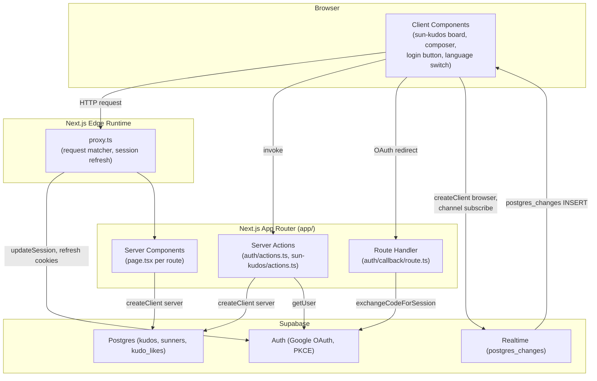
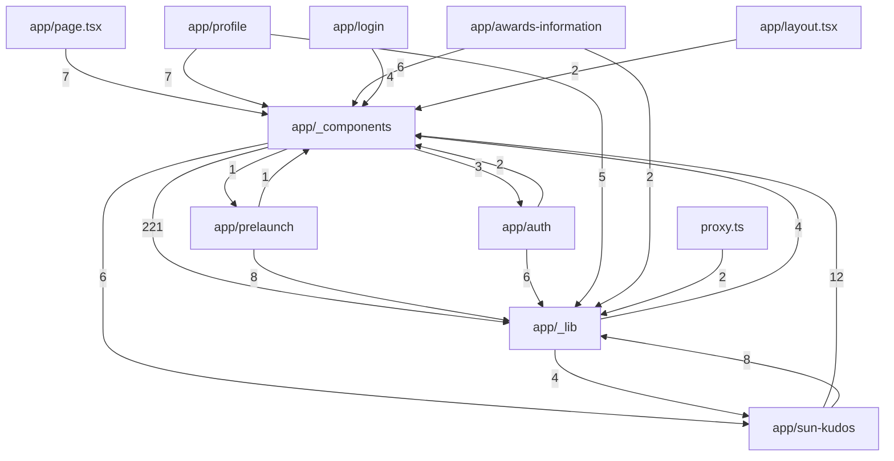
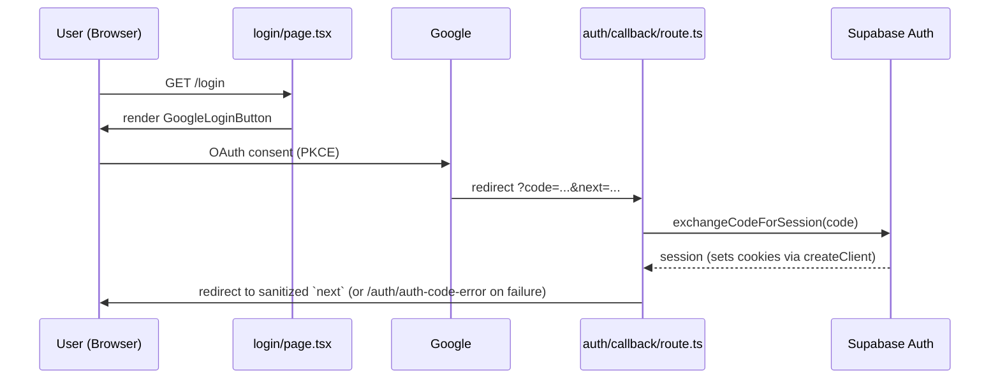
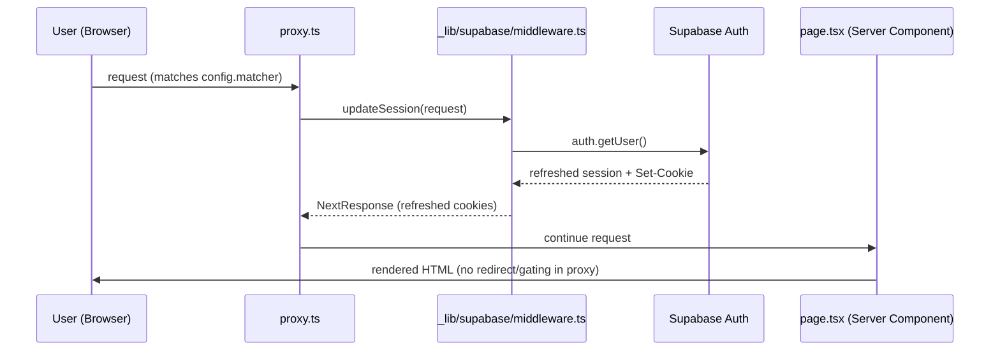

# Architecture

## System Architecture

Sun* Annual Awards 2025 is a single Next.js 16 (App Router) web app (`app/`) backed directly by
Supabase (Postgres + Auth + Realtime) via the anon/publishable key — no custom backend API layer.
Next.js 16 renamed the `middleware.ts` convention to `proxy.ts` (same signature, `config.matcher`
unchanged); this repo has already migrated (`proxy.ts:1-15`, comment confirms the rename).

### Runtime layers



- `proxy.ts` is refresh-only (`app/_lib/supabase/middleware.ts:updateSession`) — it calls
  `supabase.auth.getUser()` on every matched request to rotate an expiring access token and write
  the refreshed cookies onto the response; it does **not** gate routes (no `if (!user) redirect(...)`
  anywhere in it). Matcher excludes `_next/static`, `_next/image`, `favicon.ico`, and static image
  extensions (`proxy.ts:12-14`).
- Server Components read Supabase through `app/_lib/supabase/server.ts:createClient` — a **new**
  `createServerClient` instance per request (never a server-side singleton), built on `@supabase/ssr`
  and Next's async `cookies()`.
- Client Components read/write through `app/_lib/supabase/client.ts:createClient` — a **module-level
  singleton** `createBrowserClient`, deliberately reused across remounts (the header re-renders per
  page) to avoid churning the `onAuthStateChange` listener.
- Only one Route Handler exists in the app: `app/auth/callback/route.ts` (`GET`), the OAuth PKCE
  callback. Everything else that mutates data is a Server Action (`"use server"`): `app/auth/actions.ts`
  (`signOut`) and `app/sun-kudos/actions.ts` (`createKudo`, `toggleHeart`).
- Realtime is client-only: `app/_components/sun-kudos/use-kudos-realtime.ts` opens one
  `postgres_changes` channel (`kudos-live-board`) on the browser singleton client to push new Kudos
  onto the live board without a page reload.

### Module import graph (code, verified)

Derived from the extracted import graph (37 scanned modules; 11 of them carry cross-file import
edges — the other 26, `docs/**`, `README.md`, `AGENTS.md`, `CLAUDE.md`, and the root config files
(`package.json`, `tsconfig.json`, `eslint.config.mjs`, `next.config.ts`, `postcss.config.mjs`), plus
the 10 standalone `e2e/*.spec.ts` files and `playwright.config.ts`/`vitest.config.ts`/
`vitest.setup.ts`, are leaf nodes with no detected cross-file import edges — they are docs/config/
single-file-test artifacts, not part of the runtime dependency graph). The graph below keeps only the
connected, code-import edges; each was spot-checked against source:



Notes on the shape (verified against source, not just the raw counts):
- `app/_components` (204 symbols) is the largest module and the import hub — every route module
  (`sun-kudos`, `page.tsx`, `profile`, `awards-information`, `login`, `layout.tsx`, `prelaunch`) imports
  UI from it, and it imports heavily (221 edges) from `app/_lib` for content/types/data helpers (e.g.
  `app/_lib/sun-kudos-content.ts`, `app/_lib/kudos/types.ts`).
- The `lib → components` (4) inverse edge is real but narrow: e.g.
  `app/_lib/i18n/test-utils.tsx` and `app/_lib/i18n/use-translation.test.tsx` import
  `LanguageProvider` from `app/_components/i18n/language-provider.tsx` for test harnesses — a
  test-only lib→component dependency, not a runtime layering violation.
- The `auth ↔ components` bidirectional edges are both real: `app/_components/homepage-saa/account-menu.tsx`
  imports from `app/auth` (sign-out action), while `app/auth/auth-code-error/page.tsx` imports
  `Header`/`Footer` from `app/_components/homepage-saa/`.
- `proxy.ts → app/_lib` (2) is the single import of `updateSession` from
  `app/_lib/supabase/middleware.ts`.
- Self-contained leaf routes with **no outgoing edges into other route modules**: `app/awards-information`,
  `app/login`, `app/prelaunch`, `app/profile` — each depends only on `app/_components` / `app/_lib`,
  never on a sibling route module (no route-to-route coupling detected).

## Tech Stack

| Layer | Technology | Version | Notes |
|-------|------------|---------|-------|
| Framework | Next.js (App Router) | 16.2.9 | `middleware.ts` → `proxy.ts` rename adopted (`proxy.ts`) |
| UI runtime | React / React DOM | 19.2.4 | Server Components + Client Components (`"use client"`) |
| Language | TypeScript | 5.9.3 (`^5` in `package.json`) | `strict: true`, path alias `@/*` (`tsconfig.json`) |
| Styling | Tailwind CSS | 4.3.2 (`^4`) via `@tailwindcss/postcss` | `postcss.config.mjs` |
| Backend-as-a-service | Supabase (`@supabase/ssr`, `@supabase/supabase-js`) | 0.12.0 / 2.110.0 | Anon/publishable key only — no service-role key in app code (`.env.example`) |
| Database | Postgres (Supabase-managed) | — | 5 migrations under `supabase/migrations/`: `0001_kudos_schema`, `0002_kudos_sender_identity`, `0003_kudos_realtime`, `0004_kudos_likes`, `0005_sunners_auth_link` |
| Realtime | Supabase Realtime (`postgres_changes`) | via `@supabase/supabase-js` 2.110.0 | One channel, `kudos-live-board` (`use-kudos-realtime.ts`) |
| Auth | Supabase Auth — Google OAuth (PKCE) | via `@supabase/ssr` 0.12.0 | Callback: `app/auth/callback/route.ts` |
| Unit/component testing | Vitest + Testing Library + jsdom | 4.1.9 / 16.3.2 / 29.1.1 | `vitest.config.ts`, `vitest.setup.ts` |
| E2E testing | Playwright | 1.61.1 | `playwright.config.ts`, 10 specs under `e2e/` |
| Lint | ESLint (`eslint-config-next`) | 9.39.4 / 16.2.9 | `eslint.config.mjs` |
| i18n | Custom (no library) | — | `app/_components/i18n/language-provider.tsx` (client), string catalogs under `app/_lib/i18n/messages/{en,vi}-*.ts` |

No queue, cache layer, or separate API gateway exists — Server Components/Actions call Supabase
directly; there is no service to document at those layers (`{CACHE_TYPE}`/`{QUEUE_TYPE}` from the
generic template are intentionally omitted as not-applicable rather than fabricated).

DB-side automation (the only "background" logic in the system) lives in two SECURITY DEFINER
Postgres functions: `kudo_likes_count_sync()` keeps `kudos.like_count` in sync on like/unlike
(`0004_kudos_likes.sql`), and `handle_new_member()` on `auth.users` AFTER INSERT auto-creates a
linked `sunners` row (`auth_user_id`) on a member's first Google login — non-blocking by design
(`EXCEPTION WHEN OTHERS THEN RETURN NEW`) with a backfill for earlier logins
(`0005_sunners_auth_link.sql`). Field-level detail: `docs/generated/entities.md` (MODEL001/MODEL003).

## Data Flow

### 1. Google OAuth sign-in (F005)



### 2. Every request — session refresh (proxy.ts, F005)



### 3. Create a Kudo (F007) + live board push (F008)

```mermaid
sequenceDiagram
    participant U as User (Composer, Client Component)
    participant A as sun-kudos/actions.ts (Server Action)
    participant DB as Supabase Postgres (kudos, sunners)
    participant RT as Supabase Realtime
    participant B as Other browsers (live board)

    U->>A: createKudo(input)
    A->>DB: auth.getUser() (must be logged in)
    A->>DB: select sunners.id by auth_user_id (sender_id)
    A->>DB: select receiver department
    A->>DB: insert into kudos
    DB-->>A: insert result
    A->>U: revalidatePath('/sun-kudos'); {ok, error?}
    DB->>RT: postgres_changes INSERT on kudos
    RT->>B: push new row (kudos-live-board channel)
```

### 4. Toggle a heart / like (F015)

```mermaid
sequenceDiagram
    participant U as User (kudo card)
    participant A as sun-kudos/actions.ts:toggleHeart
    participant DB as Supabase Postgres (kudo_likes)

    U->>A: toggleHeart(kudoId)
    A->>DB: auth.getUser()
    A->>DB: insert into kudo_likes(kudo_id, user_id)
    alt insert conflicts (23505 unique_violation)
        A->>DB: delete from kudo_likes (un-like)
    end
    DB-->>A: like_count (DB trigger keeps it in sync, not written by the action)
    A->>U: revalidatePath('/sun-kudos', '/profile'); {ok, liked, likeCount}
```
