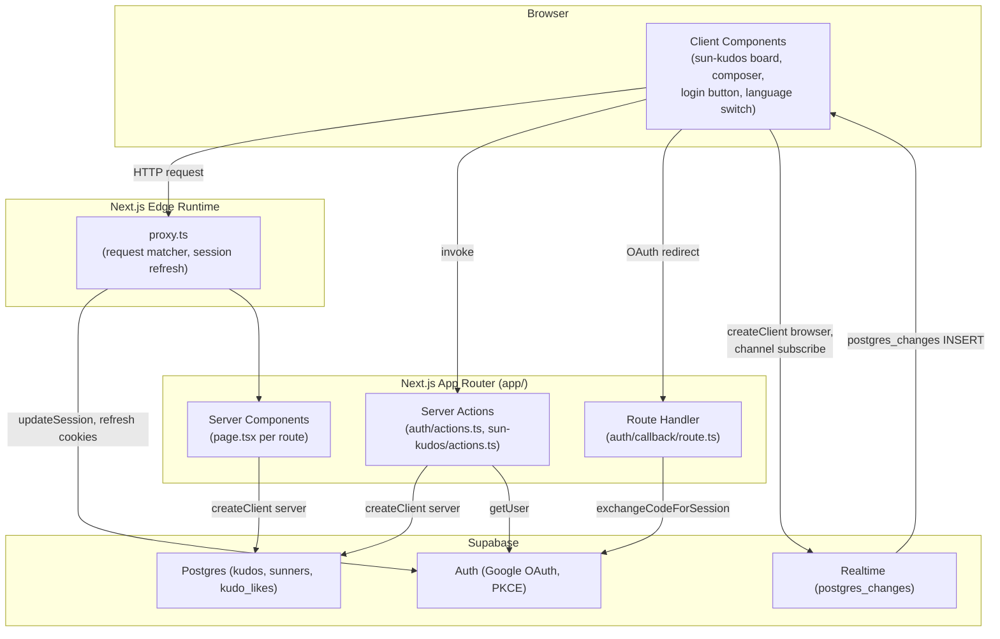
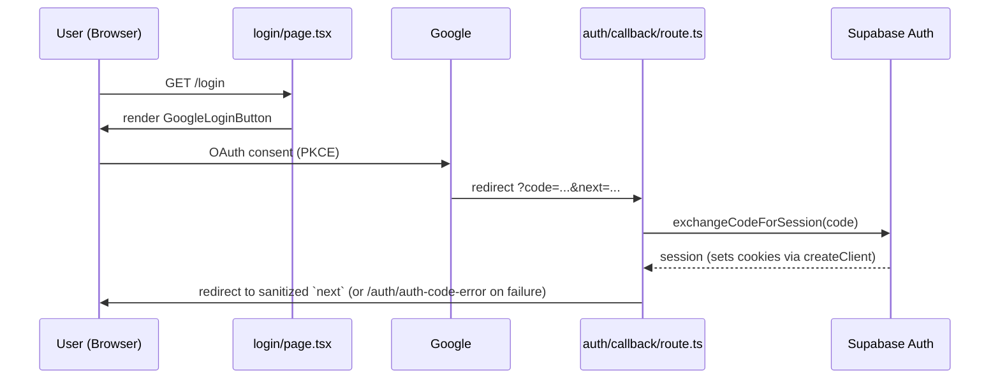

# System Overview

**Project**: Sun* Annual Awards 2025 (`aidd-ssa-2026`)
**Generated**: 2026-07-17
**Architecture Type**: Server-rendered monolith — Next.js 16 App Router (Server Components + Server Actions) over a Supabase BaaS backend (Postgres + Auth + Realtime), anon-key only, no custom API server

## Executive Summary

A single Next.js 16.2.9 / React 19.2.4 App Router application (`package.json`) serving the Sun* Annual Awards 2025 internal event: a public marketing homepage, awards-category info, a Google-OAuth-gated Sun* Kudos recognition wall with a live realtime spotlight board, and a per-user profile. Routes are file-based under `app/`: `/` (`app/page.tsx`), `/awards-information` (`app/awards-information/page.tsx`), `/sun-kudos` (`app/sun-kudos/page.tsx`), `/profile` (`app/profile/page.tsx`), `/login` (`app/login/page.tsx`), `/prelaunch` (`app/prelaunch/page.tsx`), plus the OAuth plumbing routes `app/auth/callback/route.ts` and `app/auth/auth-code-error/page.tsx`. There is no separate backend service — all persistence and auth run through Supabase (`@supabase/ssr` ^0.12.0, `@supabase/supabase-js` ^2.110.0) using only the public anon key (`.env.example` — `NEXT_PUBLIC_SUPABASE_ANON_KEY`; no `service_role` key present anywhere in the repo), so Postgres Row-Level Security is the sole data-access boundary. Client-side i18n (vi/en) is a dependency-free Context provider (`app/_components/i18n/language-provider.tsx`), not a routing-level i18n framework. Styling is Tailwind v4 (`@tailwindcss/postcss`). Tests: Vitest (unit) + Playwright (e2e).

## System Architecture

### High-Level Architecture

Full runtime-layer notes, the module import graph, and the four sequence-diagram data flows live in
[architecture.md](architecture.md) — this is the compact system-level view (verified source: `proxy.ts`,
`app/_lib/supabase/{client,server,middleware}.ts`, `app/sun-kudos/actions.ts`, `app/auth/actions.ts`,
`app/auth/callback/route.ts`, `app/_components/sun-kudos/use-kudos-realtime.ts`).

### Technology Stack

| Layer | Technology | Version | Notes |
|-------|------------|---------|-------|
| Framework | Next.js (App Router) | 16.2.9 | `middleware.ts` → `proxy.ts` rename adopted (`proxy.ts`) |
| UI runtime | React / React DOM | 19.2.4 | Server Components + Client Components (`"use client"`) |
| Language | TypeScript | 5.9.3 (`^5` in `package.json`) | `strict: true`, path alias `@/*` (`tsconfig.json`) |
| Styling | Tailwind CSS | 4.3.2 (`^4`) via `@tailwindcss/postcss` | `postcss.config.mjs` |
| Backend-as-a-service | Supabase (`@supabase/ssr`, `@supabase/supabase-js`) | 0.12.0 / 2.110.0 | Anon/publishable key only — no service-role key in app code (`.env.example`) |
| Database | Postgres (Supabase-managed) | — | 5 migrations under `supabase/migrations/`: `0001_kudos_schema`, `0002_kudos_sender_identity`, `0003_kudos_realtime`, `0004_kudos_likes`, `0005_sunners_auth_link` |
| Realtime | Supabase Realtime (`postgres_changes`) | via `@supabase/supabase-js` 2.110.0 | One channel, `kudos-live-board` (`use-kudos-realtime.ts`) |
| Auth | Supabase Auth — Google OAuth (PKCE) | via `@supabase/ssr` 0.12.0 | Callback: `app/auth/callback/route.ts` |
| Unit/component testing | Vitest + Testing Library + jsdom | 4.1.9 / 16.3.2 / 29.1.1 | `vitest.config.ts`, `vitest.setup.ts` |
| E2E testing | Playwright | 1.61.1 | `playwright.config.ts`, 10 specs under `e2e/` |
| Lint | ESLint (`eslint-config-next`) | 9.39.4 / 16.2.9 | `eslint.config.mjs` |
| i18n | Custom (no library) | — | `app/_components/i18n/language-provider.tsx` (client), string catalogs under `app/_lib/i18n/messages/{en,vi}-*.ts` |

No queue, cache layer, or separate API gateway exists — Server Components/Actions call Supabase
directly; there is no service to document at those layers.

## Data Flow

Representative request flow — Google OAuth login (PKCE) via Supabase (adapted verbatim from architecture.md, which carries three further sequence diagrams: per-request session refresh, create-Kudo + Realtime push, toggle-heart):

## Key Design Decisions

### Decision 1: Next.js 16's `proxy.ts` replaces the `middleware.ts` file convention

**Context**: Next.js 16 renamed the root request-interception file convention from `middleware.ts` to `proxy.ts` (same export signature and `config.matcher`, different filename/export name). This app needs a Supabase session-refresh hook to run on every request.

**Decision**: The root file is `proxy.ts` (not `middleware.ts`), exporting `async function proxy(request)` that delegates immediately to `updateSession(request)` in `app/_lib/supabase/middleware.ts`, with the same `matcher` excluding `_next/static`, `_next/image`, `favicon.ico`, and static image extensions.

**Rationale**: Documented inline as a breaking-change adaptation — "Next 16 renamed the `middleware` file convention to `proxy` (same signature; config.matcher unchanged)" (`proxy.ts:5`). Confirms AGENTS.md's warning that this Next.js version diverges from prior-generation conventions.

### Decision 2: Three separate Supabase clients, one per execution context — no shared singleton across contexts

**Context**: `@supabase/ssr` requires different cookie-adapter plumbing depending on whether code runs in the browser, in a Server Component/Route Handler/Server Action, or in the edge proxy.

**Decision**: Three distinct factories: a **module-level singleton** browser client (`app/_lib/supabase/client.ts`) used by client components (`google-login-button.tsx`, `account-menu.tsx`, `use-kudos-realtime.ts`); a **per-request** async server client (`app/_lib/supabase/server.ts`, built on `await cookies()`) used by every Server Component/Action/Route Handler; and a **middleware-only** helper (`app/_lib/supabase/middleware.ts`) that builds its own request-bound client inside `updateSession()`.

**Rationale**: The server client is deliberately never a singleton — "a shared instance would leak one request's cookies into another" (`server.ts:6`). The browser client is deliberately a singleton — client components like `Header`/`AccountMenu` remount on every navigation, so a fresh client per mount would churn the `onAuthStateChange` subscription (`client.ts:5-6`). The middleware helper exists only to refresh an expiring access token before any Server Component reads cookies, since Server Components can only read, never write, cookies (`middleware.ts:4-7`, `docs/system/architecture.md:80-86`).

### Decision 3: Row-Level Security is the only authorization layer — anon key everywhere, no server-side admin bypass

**Context**: The environment ships only `NEXT_PUBLIC_SUPABASE_ANON_KEY` (`.env.example`); there is no `service_role` key anywhere, so every read/write — from Server Components, Server Actions, and the browser — goes through the same RLS-constrained anon/authenticated Postgres role.

**Decision**: Public tables (`kudos`, `sunners`, `recent_gifts`, `kudos_stats`, `kudo_likes`) allow public `SELECT` (recognition wall is meant to be publicly viewable). Mutating policies are scoped to the `authenticated` role and, where a row has a natural owner, to `auth.uid()`: `kudos` INSERT requires `authenticated` (`supabase/migrations/0002_kudos_sender_identity.sql:15-16`, replacing an earlier demo-permissive anon-insert policy); `kudo_likes` INSERT/DELETE require `auth.uid() = user_id` (`supabase/migrations/0004_kudos_likes.sql:19-24`); `kudos.like_count` has **no** client-facing UPDATE policy at all — it is mutated exclusively by a `SECURITY DEFINER` trigger function (`supabase/migrations/0004_kudos_likes.sql:29-55`) fired on `kudo_likes` INSERT/DELETE. Server Actions (`app/sun-kudos/actions.ts` — `createKudo`, `toggleHeart`; `app/auth/actions.ts` — `signOut`) call `supabase.auth.getUser()` before any privileged write and return a stable, non-secret error code (`auth_required`, `missing_fields`, `unknown`) rather than surfacing raw errors.

**Rationale**: Since the same anon key is exposed to the browser, there is no way to enforce authorization in application code alone — RLS policy correctness is the entire security boundary. The `toggleHeart` action deliberately uses an "INSERT-first" pattern (attempt insert, catch Postgres `23505` unique-violation to detect an existing like and flip to delete) specifically to avoid a read-then-write race window without needing a transaction (`app/sun-kudos/actions.ts:124-161`).

### Decision 4: The Spotlight Board layers a client-side Realtime channel over a one-shot server snapshot, not a websocket-first design

**Context**: `/sun-kudos`'s live board (F008) needs to show new Kudos arriving in near-real-time without turning the whole page into a client-rendered app.

**Decision**: `getSpotlight()` (`app/_lib/kudos/queries.ts:88-127`) does one server-side read (capped at `SPOTLIGHT_NODE_CAP = 250` distinct recent receivers) that renders as the initial HTML. A separate client hook, `useKudosRealtime()` (`app/_components/sun-kudos/use-kudos-realtime.ts`), subscribes via the existing **browser client singleton** (no second socket) to `postgres_changes` INSERT events on `public.kudos` on a channel named `"kudos-live-board"`, added to the `supabase_realtime` publication in `supabase/migrations/0003_kudos_realtime.sql`. On `CHANNEL_ERROR`/`TIMED_OUT` it only logs — the UI keeps the last server snapshot with no user-facing error.

**Rationale**: Documented risk trade-off in `docs/system/architecture.md:183-187`: Postgres Changes broadcasts to every subscriber with no server-side row filtering, "acceptable at this scale" — a broadcast-from-DB filtering alternative is explicitly named as YAGNI for now. There is also no reconnect/backoff logic; a dropped socket silently degrades to the static snapshot rather than erroring.

## Security Overview

- **Authentication**: Google OAuth via Supabase Auth, PKCE flow. Client triggers `signInWithOAuth({provider:'google', redirectTo: <origin>/auth/callback})`; `app/auth/callback/route.ts` exchanges the returned `code` for a session via `exchangeCodeForSession`, redirecting to a `sanitizeNext`-cleaned path on success or `/auth/auth-code-error` on failure. Server-side identity checks use `supabase.auth.getUser()` (network-verified) rather than `getSession()` (unverified cookie read) — called out explicitly as a deliberate choice in `docs/system/architecture.md:88-93`. Session persists via HttpOnly cookies managed by `@supabase/ssr`'s `getAll`/`setAll` adapter; sign-out (`app/auth/actions.ts`) clears cookies server-side then revalidates and redirects.
- **Authorization**: No application-level RBAC/roles — Postgres RLS is the only authorization mechanism (see Decision 3). No route is gated: `proxy.ts`/`updateSession()` is refresh-only, with no `if (!user) redirect(...)` anywhere in the codebase (confirmed by comments in `middleware.ts:4` and `docs/system/architecture.md:67`). Ownership checks (`auth.uid() = user_id`) exist only for `kudo_likes` rows.
- **Data Encryption**: Not implemented at the application-code layer; relies entirely on the Supabase platform's managed TLS-in-transit and Postgres at-rest defaults. No code-level encryption, hashing, or secret-management logic was found in the repo.
- **API Security**: Only the public anon key is ever configured (`.env.example`); all mutations run through Next.js Server Actions (`createKudo`, `toggleHeart`, `signOut`), which carry Next's built-in same-origin POST enforcement rather than any custom CSRF code. No rate-limiting, request-signing, or WAF logic exists in the repo — API security is Server-Action-plus-RLS only, by design for this internal event site.

## Scalability

- **Current Capacity**: Hard-coded caps sized for an internal event, not a public-scale service: `SPOTLIGHT_NODE_CAP = 250` distinct receivers on the live board (`app/_lib/kudos/queries.ts:88`), Highlight section capped at top-5 (`getHighlightKudos` `.limit(5)`, `queries.ts:56`), "recent gifts" capped at 10 (`getRecentGifts` `.limit(10)`, `queries.ts:151`).
- **Scaling Strategy**: No caching layer beyond Next.js `revalidatePath` invalidation after writes (`/sun-kudos`, `/profile`). Realtime fan-out uses unfiltered Supabase Postgres Changes broadcast (every subscriber receives every INSERT) — an explicitly accepted trade-off at current scale, with a server-side-filtered "broadcast-from-DB" approach named as the scale-up path if ever needed (`docs/system/architecture.md:183-187`). All data reads are fail-safe (catch-and-return-empty on DB/network error, per `queries.ts` throughout), so degraded Supabase availability degrades the UI gracefully rather than 500ing.
- **Performance Targets**: None found in code, config, or docs — no SLOs, load-test results, or performance budgets are defined anywhere in the repository.

## Unresolved / Not Found in Code
- No explicit performance targets or capacity-planning numbers beyond the hard-coded query limits cited above.
- No application-level encryption/secret-handling code exists to describe; the Security Overview's "Data Encryption" line reflects an absence, not an oversight.
- `docs/system/architecture.md` and `docs/features/F001-F015` were consulted for corroboration only; every claim above was independently re-verified against the cited source files/lines during this pass.
