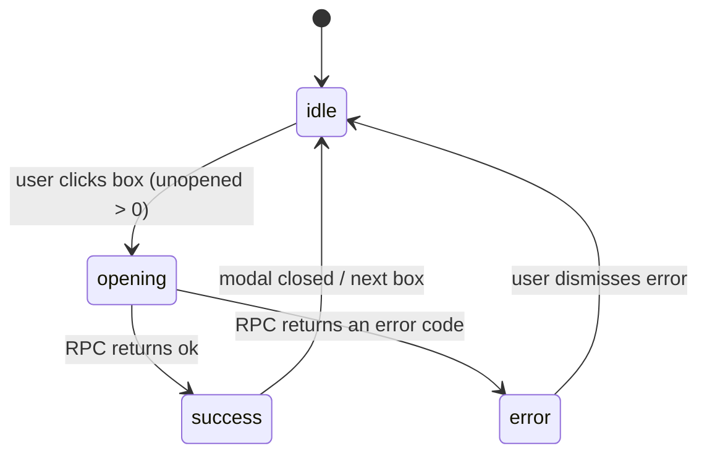

# F000_OpenSecretBox

**Priority**: P1
**Type**: mixed
**Generated**: 2026-07-18

## Overview

Open Secret Box lets a logged-in Sunner see how many Secret Boxes they have earned and open them
one at a time from a single shared modal, reached from either the Kudos sidebar or the Profile
page CTA. Entitlement is derived from real hearts received on Kudos (5 hearts = 1 box) minus boxes
already opened, and every open is resolved atomically server-side by a `SECURITY DEFINER` Postgres
RPC, so the client can never forge a count or a badge. Opening a box assigns exactly one badge at
random from six fixed collectible codes, weighted 30/25/10/5/20/10, and the same modal immediately
shows the new badge and the decremented count.

## Polymorphic Behavior

N/A — no discriminator fields in Key Entities.

Note: `sunner_badges.badge_code` is a fixed 6-value enum (`STAY_GOLD`, `FLOW_TO_HORIZON`,
`BEYOND_THE_BOUNDARY`, `ROOT_FURTHER`, `TOUCH_OF_LIGHT`, `REVIVAL`) and is a strong DISC-###
candidate once a project `data-model.md` exists. No `data-model.md` has been generated yet in this
greenfield pass (DISC-### allocation is DataModel-researcher-owned and project-scoped), so no
DISC-### code is fabricated here. Its per-value client behavior is instead captured under
`ALG-001` (weighted selection) and `BR-004` (fallback on unknown value) below, pending formal
DISC-### promotion at the Core reconcile pass.

## Cross-Cutting Logic

### Requirements

None — every FR below applies to exactly one User Story (see Placement Rules); none spans ≥2 USs
equally.

### Business Rules

### BR-001_EntitlementFloorAtZero
**Linked FR:** FR-004
**Source:** TBD (draft) — not yet implemented; planned in the read path backing the modal (see
Assumption on the 2-query vs. dedicated-RPC choice).
**Applies to:** the unopened-box count shown by the modal and re-derived by `open_secret_box()`
**Rule:** `unopened = GREATEST(0, FLOOR(total hearts received by this sunner / 5) - COUNT(sunner_badges rows for this sunner))`.
Never negative — a sunner who has somehow opened more boxes than their hearts currently justify
(e.g. a later heart removal) sees `0`, not a negative number.

**Pseudocode:**
```text
received_hearts = SUM(kudos.like_count WHERE kudos.receiver_id = sunner.id)
opened = COUNT(sunner_badges WHERE sunner_badges.sunner_id = sunner.id)
unopened = GREATEST(0, FLOOR(received_hearts / 5) - opened)
```

### BR-002_ClientCannotForgeCountOrBadge
**Linked FR:** FR-005
**Source:** TBD (draft) — planned in migration `0006` (new `sunner_badges` table + RLS) and the
`open_secret_box()` RPC.
**Applies to:** all reads/writes touching `sunner_badges`
**Rule:** the anon-key client has public `SELECT` only on `sunner_badges` — no client-side
`INSERT`/`UPDATE`/`DELETE` policy exists. The only way a row is ever written is the
`SECURITY DEFINER` RPC `open_secret_box()`, which re-derives entitlement from `kudos`/`kudo_likes`
itself (never trusts a count or badge value sent by the client). A tampered client request (stale
count, forged badge code) has no code path that can persist it.

**Pseudocode:**
```text
-- RLS on sunner_badges:
-- SELECT: to public using (true)
-- INSERT/UPDATE/DELETE: no policy defined -> denied for anon/authenticated roles
-- Only path that writes: open_secret_box() (security definer, owns the table)
```

### Decision Logic

**Subtypes** (list — declare ≥1, may declare multiple):
- `render` — multi-predicate render branches (single-field → DISC)
- `interaction` — event handlers altering visible UI state with business meaning
- `flow` — multi-step wizard / in-feature routing / post-action navigation

---

#### DEC-001_BoxOpenGate
**subtype:** interaction
**Triggers in:** SCR-secret-box-modal (draft, no SCR### yet) — box-illustration `onClick`
**Involved entities:** computed `unopened` count (derived from `Kudo.like_count` sum and
`SunnerBadge` row count — see `BR-001`)
**user_visible_outcome:** the exact same click on the box either reveals a brand-new badge and
decrements the counter (`unopened > 0`) or produces no visible change at all (`unopened <= 0`) —
the branch changes what the user sees and whether a background write happens.
**Source:** TBD (draft) — new client component `SecretBoxModal`, not yet written.

```pseudo
onBoxClick():
  if unopened <= 0: return               // inert / disabled — no request sent
  result = openSecretBox()               // server action -> RPC
  if result.ok:
    showBadge(result.badgeCode)
    unopened = result.remaining
  else:
    showInlineError(result.error)
```

---

### State Machines

**`kind` values:**
- `entity` — tracks domain object lifecycle. State is persisted (DB column, ORM attribute).
- `ui` — tracks view-layer async state. State is component-local (useState, ref) — not persisted.

### SM-001_SecretBoxModalStatus
**kind:** ui
**Linked FR:** FR-005
**Source:** TBD (draft) — new client component `SecretBoxModal`, not yet written.
**States:** idle, opening, success, error



**Transition rules:**
- `idle → opening`: guard = `unopened > 0`; side effect = disable box, call `openSecretBox()` server action
- `opening → success`: guard = RPC returns `{ ok: true, badgeCode, remaining }`; side effect = render badge inside box frame, update counter
- `opening → error`: guard = RPC returns `{ ok: false, error }`; side effect = show inline message (e.g. `no_boxes`, `auth_required`)

### Algorithms

### ALG-001_WeightedBadgeSelection
**Linked FR:** FR-005
**Source:** TBD (draft) — planned inside `open_secret_box()`, migration `0006` (not yet written).
**Input:** none (draws from the server's own `random()`)
**Output:** exactly one `badge_code` from the six fixed values
**File Schema**: N/A — not a file-exchange type.
**Complexity:** O(1)
**Description:** draws one uniform `random()` value in `[0, 1)` and maps it to one of six
cumulative weight bands (30/25/10/5/20/10, summing to 100) to select exactly one `badge_code`. The
draw and the `INSERT` happen inside the same `SECURITY DEFINER` function call as the entitlement
check (`BR-001`), so the pick and the write are atomic — no separate "pick then persist" step that
a client or a race could interrupt.

**Pseudocode:**
```text
r = random() * 100
if r < 30:  badge = STAY_GOLD
elif r < 55: badge = FLOW_TO_HORIZON
elif r < 65: badge = BEYOND_THE_BOUNDARY
elif r < 70: badge = ROOT_FURTHER
elif r < 90: badge = TOUCH_OF_LIGHT
else:        badge = REVIVAL
insert into sunner_badges (sunner_id, badge_code) values (caller_sunner_id, badge)
```

### External Integrations

None. The Postgres RPC is this project's primary datastore (Supabase), not a third-party
integration — consistent with how existing server actions (`app/sun-kudos/actions.ts`) treat
Supabase calls as core data access rather than `INT-###`.

### Verification

- **SC-001** — the unopened count shown in the modal always equals
  `FLOOR(received_hearts / 5) - opened`, never negative (covers FR-004, BR-001)
- **SC-002** — a box click while `unopened > 0` always results in exactly one new `sunner_badges`
  row and a counter decrease of exactly 1 (covers FR-005, FR-006, BR-003)
- **SC-003** — a box click while `unopened <= 0` never calls the RPC and never changes any count
  (covers FR-007, DEC-001)
- **SC-004** — no client-supplied count or badge value is ever persisted without passing through
  `open_secret_box()`; RLS on `sunner_badges` rejects every client `INSERT`/`UPDATE`/`DELETE`
  (covers BR-002)

---

**Client behavior:** see
[`behavior-logic.md`](../../docs/system/behavior-logic.md) (client-side patterns — debounce, optimistic UI, polling, upload, realtime),
[`permissions.md`](../../docs/system/permissions.md) (feature flags / experiments / env / locale gates),
[`architecture.md`](../../docs/system/architecture.md) (guards / deep-link state restoration / unsaved-changes protection).

## User Stories

### US001_ViewSecretBoxEntitlement (Priority: P1)

**What happens:** A logged-in Sunner clicks the "Open Secret Box" button on either the Kudos
sidebar or the Profile page; the shared modal opens and shows the title, an instruction line
(hidden when the count is 0), the box illustration, and their current unopened-box count, all
sourced from real per-user data rather than a placeholder.
**Why this priority:** this is the entry point every other story depends on — nothing else in the
feature is reachable without it.
**Independent Test:** open the modal as a sunner with a known unopened count (e.g. seeded with 4)
and confirm the counter reads "04" and the instruction line is visible.

**Acceptance Scenarios:**

1. **Given** a signed-in Sunner with 4 unopened boxes, **When** they click either CTA, **Then** the
   modal opens showing "KHÁM PHÁ SECRET BOX CỦA BẠN", the instruction line, the box illustration,
   and the counter "04".
2. **Given** a signed-in Sunner with 0 unopened boxes, **When** they open the modal, **Then** the
   instruction line is hidden and the counter reads "00".

**Requirements fulfilled:**
- **FR-001** Both existing CTAs (kudos-sidebar + profile-stats) open one shared modal component —
  via a new `onClick` wired onto each existing button
  **Source:** `app/_components/sun-kudos/kudos-sidebar.tsx:41-50`, `app/_components/profile/profile-stats.tsx:37-44` (existing CTA markup, currently visual-only)
- **FR-002** Modal renders per design frame J3-4YFIpMM: gold uppercase title, white "X" close
  (top-right), divider, instruction line, centered box illustration, bottom counter (white label +
  yellow number) — via a new `SecretBoxModal` component reusing the portal/backdrop/a11y shape of
  `RulesModal`, centered like `WriteKudoModal`
  **Source:** TBD (draft) — new component, not yet written; reuses the pattern at `app/_components/sun-kudos/rules-modal.tsx:26-49` and the centered-wrapper layout at `app/_components/sun-kudos/write-kudo-modal.tsx:89-90`
- **FR-003** The instruction line ("Click vào box để mở") is hidden whenever the unopened count is 0
  **Source:** TBD (draft) — new component, not yet written
- **FR-004** The modal's initial unopened/opened counts are computed server-side per `BR-001` before
  the modal is shown (server-rendered props, mirroring the existing `getSidebarStats()` read shape)
  **Source:** TBD (draft) — new read query, not yet written; existing shape at `app/_lib/kudos/queries.ts:130-142`

**Rules enforced:** BR-001 (see `## Cross-Cutting Logic`)

**Verification:**
- **SC-001** (see `## Cross-Cutting Logic > Verification`)

---

### US002_OpenEarnedSecretBox (Priority: P1)

**What happens:** With at least one unopened box, the Sunner clicks the box illustration; the
client calls a server action that invokes the `open_secret_box()` RPC, which atomically checks
entitlement, picks one weighted-random badge, records it, and returns the badge plus the new
remaining count. The modal then shows the badge inside the box frame and the decremented counter.
**Why this priority:** this is the feature's actual reward action — the whole point of the modal.
**Independent Test:** as a sunner with unopened = 1, click the box once and confirm exactly one of
the six badge images appears and the counter drops to 0; a second click has no effect (US003).

**Acceptance Scenarios:**

1. **Given** unopened = 2, **When** the Sunner clicks the box, **Then** exactly one badge image
   (one of the six fixed codes) appears inside the box frame and the counter shows 1.
2. **Given** a signed-in Sunner clicks the box, **When** the RPC succeeds, **Then** exactly one new
   `sunner_badges` row exists for them afterward — never zero, never more than one.

**Requirements fulfilled:**
- **FR-005** Clicking the box while `unopened > 0` calls a new server action (e.g.
  `openSecretBox()` in `app/sun-kudos/actions.ts`, mirroring the "use server" → `createClient()` →
  `auth.getUser()` → mutate → typed `{ok, error?}` shape of `createKudo`/`toggleHeart`) which
  invokes `supabase.rpc('open_secret_box')`
  **Source:** TBD (draft) — new action, not yet written; existing pattern at `app/sun-kudos/actions.ts:44-111`
- **FR-006** On success, the returned `badge_code` is mapped to its badge image (reusing/extending
  the `RULE_ICONS` name→src table) and rendered inside the box frame; the counter is set to the
  RPC's returned `remaining` value
  **Source:** TBD (draft) — new mapping, not yet written; existing table at `app/_lib/rules-content.ts:63-70`

**Rules enforced:**
- BR-003 (see below) — applies specifically to this US's write path
- BR-004 (see below) — applies specifically to this US's render path
- BR-002 (see `## Cross-Cutting Logic`) — the write this US triggers is the only write path BR-002 governs

### BR-003_ExactlyOneBadgePerOpen
**Linked FR:** FR-005
**Source:** TBD (draft) — planned inside `open_secret_box()`, migration `0006` (not yet written).
**Applies to:** the `open_secret_box()` RPC
**Rule:** each successful call inserts exactly one `sunner_badges` row and returns exactly one
`badge_code`; the entitlement check (`BR-001`) and the insert happen inside the same function
invocation, so there is no window between "check" and "write" for a second concurrent call to slip
through and over-draw the same sunner's entitlement.

**Pseudocode:**
```text
-- inside open_secret_box(), single statement/transaction:
unopened = compute_unopened(caller_sunner_id)   -- BR-001
if unopened <= 0: raise exception 'no_boxes'
badge = weighted_random_pick()                  -- ALG-001
insert into sunner_badges (sunner_id, badge_code) values (caller_sunner_id, badge)
return (badge, unopened - 1)
```

### BR-004_FallbackImageOnUnknownBadgeCode
**Linked FR:** FR-006
**Source:** TBD (draft) — new client mapping, not yet written; existing table this extends at
`app/_lib/rules-content.ts:63-70`.
**Applies to:** rendering a `badge_code` returned by the RPC or read back from `sunner_badges`
**Rule:** if a `badge_code` value does not match one of the six known codes (corrupt data, future
schema drift), the UI renders a generic fallback image instead of crashing, rendering a broken
image, or interpolating the raw value unescaped into the DOM.

**Pseudocode:**
```text
KNOWN = {STAY_GOLD, FLOW_TO_HORIZON, BEYOND_THE_BOUNDARY, ROOT_FURTHER, TOUCH_OF_LIGHT, REVIVAL}
src = KNOWN.has(badge_code) ? iconFor(badge_code) : FALLBACK_BADGE_SRC
```

**Verification:**
- **SC-002** (see `## Cross-Cutting Logic > Verification`)

---

### US003_BlockedAtZeroEntitlement (Priority: P2)

**What happens:** With unopened = 0, clicking the box produces no request and no visible change —
the box is effectively inert (disabled) rather than an active control.
**Why this priority:** correctness/safety guard rather than the primary reward path; still must
ship in the same release since a live counter of 0 with a clickable box would look broken.
**Independent Test:** as a sunner with unopened = 0, click the box repeatedly and confirm no
network call fires and the counter never goes negative.

**Acceptance Scenarios:**

1. **Given** unopened = 0, **When** the Sunner clicks the box, **Then** nothing happens — no badge
   appears, the counter stays "00", and no server action is invoked.

**Requirements fulfilled:**
- **FR-007** The box is disabled/inert whenever `unopened <= 0` — no click handler fires a request
  **Source:** TBD (draft) — new component, not yet written

**Rules enforced:** DEC-001 (see `## Cross-Cutting Logic`) — this US is the `unopened <= 0` branch of that decision

**Verification:**
- **SC-003** (see `## Cross-Cutting Logic > Verification`)

---

### US004_AuthRequiredHandling (Priority: P2)

**What happens:** A signed-out visitor clicks one of the "Open Secret Box" CTAs (both currently
render for everyone). The modal opens but shows an inline "sign in required" message instead of
box data; no entitlement is computed and no RPC call is attempted for a session-less request.
**Why this priority:** an edge case relative to the core logged-in flow, but required for
correctness since both CTAs are currently rendered unconditionally.
**Independent Test:** open the modal while signed out and confirm an auth-required message appears
in place of the counter/box content, matching the existing `auth_required` pattern used by
`createKudo`/`toggleHeart`.

**Acceptance Scenarios:**

1. **Given** no active session, **When** the visitor opens the modal, **Then** an inline
   "sign in required" message is shown instead of the counter/box content.
2. **Given** no active session, **When** the visitor (somehow) triggers a box click, **Then** the
   server action/RPC returns an `auth_required`-style error and nothing is written.

**Requirements fulfilled:**
- **FR-008** Both the initial read and the open action treat a missing session as an
  `auth_required` condition, following the exact stable-error-code + caller-translates pattern
  already used by `createKudo`/`toggleHeart` (no new login-prompt UI — an inline message, same as
  `resolveComposerError`)
  **Source:** `app/sun-kudos/actions.ts:56-60,139-141` (existing `auth_required` precedent), `app/_lib/write-kudo-error.ts:15-19,31-38` (existing stable-code → translated-message precedent)

**Rules enforced:** none beyond FR-008 (no BR duplicated here).

**Verification:**
- **SC-005** — a signed-out request never computes a real count nor calls `open_secret_box()`; it
  always short-circuits to `auth_required` (covers FR-008)

---

### Edge Cases

See `edge-cases.md` — lifted from this spec's `BR-001` (floor-at-zero), `BR-002`/`BR-003`
(atomicity/anti-forgery), `BR-004` (fallback image), `DEC-001` (click gate), and `US004`
(auth-required).

## Key Entities

| Entity | Table | Key Columns | Purpose |
|--------|-------|-------------|---------|
| SunnerBadge | `sunner_badges` (NEW — migration `0006`) | `id`, `sunner_id`, `badge_code`, `created_at` | Records each opened Secret Box per sunner; the source of truth for "opened" count and badge history |
| Sunner | `sunners` (existing) | `id`, `auth_user_id` | Resolves the currently authenticated user to their sunner row for entitlement + badge ownership (reuses the `0005` auth link) |
| Kudo | `kudos` (existing) | `receiver_id`, `like_count` | Sum of `like_count` where `receiver_id = sunner.id` is the "total hearts received" numerator in the entitlement formula |
| KudoLike | `kudo_likes` (existing) | `kudo_id`, `user_id` | Underlies `kudos.like_count` indirectly via the existing `kudo_likes_count_sync()` trigger — not read directly by this feature |

## Artifact References

| Artifact | File | Codes Used | Reviewed |
|----------|------|------------|----------|
| System Overview | [system-overview.md](../../docs/system/system-overview.md) | — | [ ] |
| Architecture | [architecture.md](../../docs/system/architecture.md) | — | [ ] |
| Feature List | [feature-list.md](../feature-list.md) | TBD (draft) | [ ] |
| API Map | [api-map.md](../../docs/generated/api-map.md) | TBD (draft) | [ ] |
| Entities | [entities.md](../../docs/generated/entities.md) | TBD (draft) | [ ] |
| Screens | [screens.md](screens.md) | TBD (draft) | [ ] |
| Behavior Logic | [behavior-logic.md](../../docs/system/behavior-logic.md) | TBD (draft) | [ ] |
| Permissions Matrix | [permissions-matrix.md](../../docs/generated/permissions-matrix.md) | TBD (draft) | [ ] |
| User Stories | [user-stories.md](../../docs/generated/user-stories.md) | TBD (draft) | [ ] |

## Assumptions

- The initial unopened/opened counts shown by the modal are computed with a 2-query server read
  (sum `kudos.like_count` for the sunner + count `sunner_badges` rows), not a dedicated read-only
  RPC — both source tables already allow public `SELECT`, so a `SECURITY DEFINER` wrapper is only
  needed for the *write* path (YAGNI). Flagged for confirmation in `## Unresolved Questions`.
- `RULE_ICONS` (`app/_lib/rules-content.ts:63-70`) maps 1:1 by name to the six `badge_code` values
  (`STAY_GOLD`, `FLOW_TO_HORIZON`, `BEYOND_THE_BOUNDARY`, `ROOT_FURTHER`, `TOUCH_OF_LIGHT`,
  `REVIVAL`); the existing file's own docstring already flags this ordering as "assumed", and this
  spec inherits that same assumption without re-verifying the underlying PNG artwork.
- The box illustration (black gift box, gold ribbon, gold podium, sparkles) does not exist in the
  repo yet and must be sourced/exported before implementation; assumed to land under a new
  `public/secret-box/` path.
- Per locked decision, the existing `kudos-sidebar.tsx` stats list (backed by the shared
  `kudos_stats` singleton) is left untouched this round — only its CTA gains an `onClick`; the
  sidebar's own "opened/unopened" numbers stay demo data, not the new per-user real count.

## Source Code References

No code for this feature has been written yet. The following EXISTING files (from adjacent,
already-shipped features) are the reuse points and modification sites this build touches:

| Order | Symbol | Path | Purpose |
|-------|--------|------|---------|
| 1 | `KudosSidebar` CTA button | `app/_components/sun-kudos/kudos-sidebar.tsx:41-50` | Existing visual-only "Open Secret Box" button to wire an `onClick` onto (FR-001) |
| 2 | `ProfileStats` CTA button | `app/_components/profile/profile-stats.tsx:37-44` | Second existing visual-only CTA, same wiring (FR-001) |
| 3 | `RulesModal` | `app/_components/sun-kudos/rules-modal.tsx:26-49` | Portal + `useMounted` + `useDialogA11y` shape to replicate for the new modal (FR-002) |
| 4 | `WriteKudoModal` centered wrapper | `app/_components/sun-kudos/write-kudo-modal.tsx:89-90` | Centered (`items-center justify-center`) dialog layout to copy instead of the right-drawer pattern (FR-002) |
| 5 | `createKudo` / `toggleHeart` | `app/sun-kudos/actions.ts:44-175` | Server-action shape to follow for the new `openSecretBox()` action: `"use server"` → `createClient()` → `auth.getUser()` → mutate → typed `{ok, error?}` (FR-005, FR-008) |
| 6 | `RULE_ICONS` | `app/_lib/rules-content.ts:63-70` | Existing badge-name → image-path table to reuse/extend for the six `badge_code` values (FR-006, BR-004) |
| 7 | `getSidebarStats` | `app/_lib/kudos/queries.ts:130-142` | Existing server-read shape (fail-safe try/catch, `.maybeSingle()`) the new entitlement read should mirror (FR-004) |
| 8 | `0005_sunners_auth_link.sql` | `supabase/migrations/0005_sunners_auth_link.sql:19-46` | `SECURITY DEFINER` + `set search_path = public` pattern to replicate in the new `open_secret_box()` RPC |
| 9 | `0004_kudos_likes.sql` | `supabase/migrations/0004_kudos_likes.sql:13-55` | RLS-policy shape (public `SELECT`, no client-writable columns, trigger-owned writes) to replicate on `sunner_badges` |
| 10 | `resolveComposerError` | `app/_lib/write-kudo-error.ts:15-38` | Stable-error-code → translated-message pattern to reuse for `auth_required`/`no_boxes` (FR-008) |

## Unresolved Questions

1. **RULE_ICONS ordering**: the existing name→file mapping (`REVIVAL`, `TOUCH OF LIGHT`,
   `STAY GOLD`, `FLOW TO HORIZON`, `BEYOND THE BOUNDARY`, `ROOT FURTHER`) is marked "assumed" in
   its own docstring — needs confirmation before reuse, since a mismatch would silently show the
   wrong badge art with no error.
2. **Instruction-line copy**: this frame's image shows "Click vào box để mở", while the MoMorph
   spec text for item B says "Click vào box để tiếp tục mở". `clarifications.md` resolves the
   *title* wording but not this line; defaulting to the frame-image text by the same rationale as
   the title decision — flag for design confirmation.
3. **Read path for initial counts**: no explicit lock beyond "spec picks one" — this spec
   recommends the 2-query server compute over a dedicated read RPC (see `## Assumptions`); flag for
   confirmation before implementation.
4. **Box illustration asset**: exact filename/path is undecided (no such asset exists in the repo
   today) — needs a design handoff before `FR-002` can be implemented pixel-for-pixel.

## Source Walkthrough

No code for this feature exists yet. The recommended reading order runs through the EXISTING files
this build reuses/extends (same set as `## Source Code References` above, re-cast in the order a
new contributor should read them):

1. **File:** `supabase/migrations/0005_sunners_auth_link.sql:1-46` — start here: shows the
   `auth_user_id` link and the `SECURITY DEFINER` + pinned `search_path` pattern the new
   `open_secret_box()` RPC must follow.
2. **File:** `supabase/migrations/0004_kudos_likes.sql:1-56` — next: shows the RLS shape
   (public `SELECT`, trigger-owned writes) the new `sunner_badges` table must mirror.
3. **File:** `app/sun-kudos/actions.ts:1-111` — next: the server-action shape (`"use server"` →
   `createClient()` → `auth.getUser()` → mutate → typed result) the new `openSecretBox()` action
   follows.
4. **File:** `app/_components/sun-kudos/rules-modal.tsx:1-49` — last: the portal/backdrop/a11y
   modal shape the new `SecretBoxModal` component is built from (centered instead of drawer, per
   `app/_components/sun-kudos/write-kudo-modal.tsx:89-90`).

### Call Hierarchy

```text
KudosSidebar / ProfileStats (onClick, NEW)
  -> SecretBoxModal (NEW client component)
       -> openSecretBox() server action (NEW, app/sun-kudos/actions.ts)
            -> supabase.rpc('open_secret_box') (NEW, migration 0006)
                 -> sunner_badges (NEW table, INSERT)
```

**Related files:** see `## Source Code References` above — the **Order** column IS this section's
related-files table (F15 DRY, one table not two).

## DB Impact per Event

| Event/Endpoint | Table | Columns | Operation | Value Derivation | Source |
|----------------|-------|---------|-----------|-------------------|--------|
| `openSecretBox()` server action → `open_secret_box()` RPC | `sunner_badges` | `id`, `sunner_id`, `badge_code`, `created_at` | INSERT | `sunner_id` from `auth.uid()` → `sunners.auth_user_id`; `badge_code` from weighted-random selection (`ALG-001`, gated by `BR-001`/`BR-003`); `created_at` defaults to `now()` | `[INFERRED]` — RPC not yet written (planned in migration `0006`, see `clarifications.md` locked decision #3) |

No other event in this feature writes to the database — every other read (entitlement count,
badge display) is `SELECT`-only.
